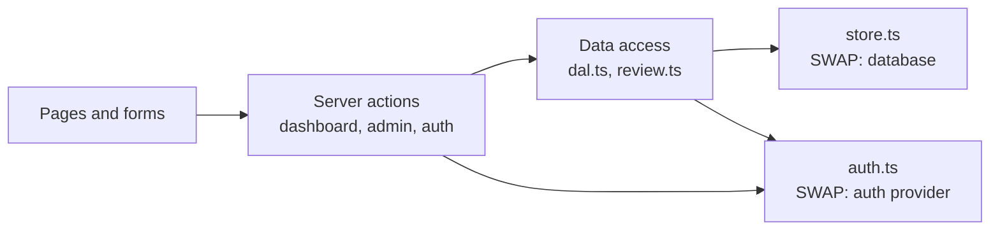

# VC Summit — Backend Integration Guide

As of 2026-09-24. How to replace the two stand-ins (sign-in and file storage) with a real backend, without changing any page.

The frontend is finished and talks to the backend through **two files only**: [src/lib/auth.ts](../src/lib/auth.ts) (accounts and sessions) and [src/lib/application/store.ts](../src/lib/application/store.ts) (data). Implement their contracts below and every page, form, validation rule and permission check keeps working. What each page does is in [pages-and-features.md](pages-and-features.md).

## Architecture today



- **Pages** are React Server Components; **forms** call **Server Actions** (no REST API exists yet).
- **Data access** (`dal.ts` for founders, `review.ts` for reviewers) resolves the user from the session, checks permissions, and is the only code that touches `store.ts`.
- **Business rules** (what's required, which status changes are allowed, validation) live in pure modules shared by the UI and the server: `progress.ts`, `decisions.ts`, `validation.ts`, `types.ts`.

## Build order

Each phase leaves the app working. Tick them off here as they land.

- [ ] **1. Database.** Implement `store.ts` against Postgres (schema below). Nothing else changes.
- [ ] **2. Accounts and sessions.** Implement `createAccount`, `signInWithPassword`, `getCurrentUser`, `endSession` in `auth.ts`. Then delete the development stand-in user (`DEV_USER`).
- [ ] **3. Roles.** Make `isReviewer` read `users.role` instead of `REVIEWER_EMAILS`.
- [ ] **4. Email verification.** Send a verification link on sign-up; don't grant reviewer access to unverified emails.
- [ ] **5. Password reset.** Implement `requestPasswordReset`, then add the `/reset-password?token=…` page (reuse `checkNewPassword` from `validation.ts`).
- [ ] **6. Google sign-in.** Add `/api/auth/callback/google`: verify `state`, exchange the code, find or create the user, start a session.
- [ ] **7. Notifications.** Email founders on decisions; email reviewers on new submissions (see *Notifications*).
- [ ] **8. Optional: separate backend service.** Only if you need a mobile app or other clients — see *REST API*.

## Contract 1: storage (`src/lib/application/store.ts`)

Three functions. The types are in [src/lib/application/types.ts](../src/lib/application/types.ts); `StoredApplication` is the full record including reviewer-only data.

```ts
findApplication(userId: string): Promise<StoredApplication | null>

listApplications(): Promise<StoredApplication[]>

updateApplication(
  userId: string,
  seed: () => StoredApplication,
  fn: (current: StoredApplication) => StoredApplication,
): Promise<StoredApplication>
```

**`updateApplication` must be atomic per application.** In SQL, one transaction:

1. `SELECT … FOR UPDATE` the application row.
2. If there is no row, call `seed()` (the founder's first visit creates a blank draft; the reviewer path passes a `seed` that throws, so reviewers can never create applications).
3. Call `fn(current)`. It is synchronous and pure, and it **may throw** (`LockedError`, `Rejected`, `ReviewRejected`): roll back and rethrow the same error untouched. The callers turn these into user-facing messages.
4. Write the returned record, commit, return it.

The rules that depend on this atomicity: the edit lock, the 100% equity cap, "complete before submit", and "two reviewers can't both decide". They are all checked *inside* `fn`, against the row as stored.

**`listApplications` loads every record today**, and the queue filters them in memory (`queue.ts`). That is fine for hundreds of applications. Past a few thousand, move the filtering and sorting into SQL and add paging to `listForReview` in `review.ts`.

## Contract 2: accounts and sessions (`src/lib/auth.ts`)

| Export | Signature | Must do |
| --- | --- | --- |
| `getCurrentUser` | `() => Promise<SessionUser \| null>`, wrapped in React `cache()` | Read the `vcs_session` cookie, look up the session by the token's hash, check expiry and revocation, return `{ id, email, name }` |
| `signInWithPassword` | `({ email, password, remember }) => Promise<AuthResult>` | Verify the password hash; create a session; set the cookie (longer `maxAge` when `remember`); return `{ ok: true, redirectTo: AFTER_SIGN_IN }`. Wrong email or password → the same generic message for both |
| `createAccount` | `({ name, email, password }) => Promise<AuthResult>` | Reject a taken email with `fieldErrors.email`; hash the password; create the user; start a session |
| `requestPasswordReset` | `({ email }) => Promise<ResetRequestResult>` | Always return `{ ok: true }`, even for unknown emails. Store a hashed, single-use token (e.g. 30-minute expiry) and email the link |
| `startGoogleOAuth` | `() => Promise<AuthResult>` | Already builds the consent URL. Add: a random `state` stored in a short-lived cookie |
| `endSession` | `() => Promise<void>` | Revoke the session server-side and delete the cookie |
| `isReviewer` | `(user: SessionUser) => boolean` | Phase 3: return `role === 'reviewer'` from the users table |

**Return shapes** (the forms already render all of them):

```ts
type AuthResult =
  | { ok: true; redirectTo: string }                                        // signed in
  | { ok: false; message?: string; fieldErrors?: Record<string, string> };  // banner / field error

type ResetRequestResult =
  | { ok: true }
  | { ok: false; message?: string; fieldErrors?: Record<string, string> };
```

**Session requirements:**

- **Cookie:** `vcs_session`, `httpOnly`, `secure`, `sameSite: "lax"`, `path: "/"`.
- **Token:** at least 32 random bytes. Store only its SHA-256 hash; never store the raw value.
- **Passwords:** hash with Argon2id (or bcrypt, cost ≥ 12). Validation rules for new passwords are already enforced in `checkNewPassword`.
- **Rate limits:** limit sign-in, sign-up and reset requests per IP and per email.
- **Stand-in user:** remove `DEV_USER` and its fallback in `getCurrentUser` in phase 2. It already can't activate in production builds, but it should not outlive real sessions.

## Database schema

Proposed PostgreSQL schema. The profile, startup and team answers are stored as JSONB. They are always read and written as whole sections, the questions will change over time, and the queue only filters on a few fields, which are exposed as generated columns.

```sql
create extension if not exists citext;

create type user_role as enum ('founder', 'reviewer');
create type application_status as enum
  ('draft', 'submitted', 'in_review', 'changes_requested', 'accepted', 'declined');

create table users (
  id                uuid primary key default gen_random_uuid(),
  email             citext not null unique,
  name              text not null,
  password_hash     text,                        -- null for Google-only accounts
  google_sub        text unique,                 -- Google account id
  role              user_role not null default 'founder',
  email_verified_at timestamptz,
  created_at        timestamptz not null default now()
);

create table sessions (
  id          uuid primary key default gen_random_uuid(),
  user_id     uuid not null references users(id) on delete cascade,
  token_hash  bytea not null unique,             -- sha256(cookie value)
  expires_at  timestamptz not null,
  revoked_at  timestamptz,
  created_at  timestamptz not null default now()
);

create table password_reset_tokens (
  token_hash  bytea primary key,                 -- sha256(token in the emailed link)
  user_id     uuid not null references users(id) on delete cascade,
  expires_at  timestamptz not null,
  used_at     timestamptz,
  created_at  timestamptz not null default now()
);

create table applications (
  user_id       uuid primary key references users(id) on delete cascade,
  status        application_status not null default 'draft',
  profile       jsonb not null,                  -- Profile
  startup       jsonb not null,                  -- Startup
  team          jsonb not null,                  -- Team (members + 3 answers)
  assignee_id   uuid references users(id) on delete set null,
  created_at    timestamptz not null default now(),
  updated_at    timestamptz not null default now(),
  submitted_at  timestamptz,
  -- exposed for the review queue's filters and sorting
  startup_name  text generated always as (startup->>'name') stored,
  stage         text generated always as (startup->>'stage') stored,
  industry      text generated always as (startup->>'industry') stored
);
create index applications_queue on applications (status, submitted_at);
create index applications_assignee on applications (assignee_id);

create table application_events (               -- the activity timeline founders see
  id              uuid primary key default gen_random_uuid(),
  application_id  uuid not null references applications(user_id) on delete cascade,
  at              timestamptz not null default now(),
  by_role         text not null check (by_role in ('founder', 'support')),  -- the record's `by`
  kind            text not null check (kind in ('created', 'submitted', 'withdrawn', 'status', 'note')),
  title           text not null,
  body            text,
  actor_id        uuid references users(id)      -- audit only; never shown to founders
);
create index application_events_by_app on application_events (application_id, at);

create table scorecards (                        -- reviewers only
  application_id  uuid not null references applications(user_id) on delete cascade,
  reviewer_id     uuid not null references users(id),
  problem         smallint check (problem  between 1 and 5),
  solution        smallint check (solution between 1 and 5),
  market          smallint check (market   between 1 and 5),
  team            smallint check (team     between 1 and 5),
  traction        smallint check (traction between 1 and 5),
  recommendation  text check (recommendation in ('accept', 'interview', 'decline')),
  summary         text not null default '' check (length(summary) <= 2000),
  updated_at      timestamptz not null default now(),
  primary key (application_id, reviewer_id)      -- one scorecard per reviewer
);

create table internal_notes (                    -- reviewers only
  id              uuid primary key default gen_random_uuid(),
  application_id  uuid not null references applications(user_id) on delete cascade,
  author_id       uuid not null references users(id),
  body            text not null check (length(body) between 1 and 2000),
  at              timestamptz not null default now()
);
```

**How the record maps to tables** (what `store.ts` assembles and splits):

| `StoredApplication` field | Stored in |
| --- | --- |
| `userId`, `status`, `createdAt`, `updatedAt`, `submittedAt` | `applications` columns |
| `profile`, `startup`, `team` | `applications.profile` / `startup` / `team` (JSONB) |
| `events[]` | `application_events` rows, ordered by `at` (`by` ↔ `by_role`) |
| `review.assigneeId`, `review.assigneeName` | `applications.assignee_id` joined to `users.name` |
| `review.scorecards[]` | `scorecards` rows; `reviewerName` joined from `users.name` |
| `review.notes[]` | `internal_notes` rows; `authorName` joined from `users.name` |

`profile.email` should always come from `users.email`, not from the JSONB. Founders can't change it through the form.

**Example record** (trimmed):

```json
{
  "userId": "3f2a9c1e-…",
  "status": "in_review",
  "createdAt": "2026-09-12T09:14:00.000Z",
  "updatedAt": "2026-09-22T16:02:11.000Z",
  "submittedAt": "2026-09-16T10:30:00.000Z",
  "profile": { "fullName": "Maya Rosen", "email": "maya@ledgerly.example", "title": "CEO & co-founder",
               "country": "United Kingdom", "linkedin": "https://linkedin.com/in/maya-rosen",
               "commitment": "full-time", "experienceYears": 6, "bio": "…", "phone": "", "city": "", "heardFrom": "" },
  "startup": { "name": "Ledgerly", "tagline": "Month-end close for agencies, done in a day", "stage": "traction",
               "industry": "Fintech", "businessModel": "Subscription (B2B)", "monthlyRevenue": 21000,
               "seeking": 1200000, "deckUrl": "https://docsend.example/ledgerly", "problem": "…", "…": "…" },
  "team": { "members": [ { "id": "…", "name": "Maya Rosen", "role": "CEO & co-founder", "equity": 55,
                           "commitment": "full-time", "isFounder": true, "email": "…", "linkedin": "" } ],
            "workedTogether": "1–3 years", "whyUs": "…", "hiringNeeds": "" },
  "events": [ { "id": "…", "at": "2026-09-16T10:30:00.000Z", "by": "founder", "kind": "submitted",
                "title": "Application submitted for review" } ],
  "review": { "assigneeId": "…", "assigneeName": "Alex Rivera",
              "scorecards": [ { "reviewerId": "…", "reviewerName": "Alex Rivera",
                                "scores": { "problem": 5, "solution": 4, "market": 3, "team": 4, "traction": 4 },
                                "recommendation": "interview", "summary": "…", "updatedAt": "…" } ],
              "notes": [] }
}
```

Numbers are stored as numbers, or `null` when unanswered; empty text answers are `""`. Links are stored with `https://`.

## Operations the backend serves

Every operation the UI performs today, as Server Actions. The form field names are listed per page in [pages-and-features.md](pages-and-features.md).

| Action | File | Who | Checks inside the atomic update | Returns |
| --- | --- | --- | --- | --- |
| `login`, `register`, `requestReset`, `continueWithGoogle` | [src/app/(auth)/actions.ts](<../src/app/(auth)/actions.ts>) | Anyone | Field validation | `AuthFormState` |
| `saveProfile`, `saveStartup`, `saveTeamDetails` | [src/app/dashboard/actions.ts](../src/app/dashboard/actions.ts) | Founder (own) | Editable status | `SaveState` |
| `saveMember(memberId \| null)`, `removeMember(memberId)` | same | Founder (own) | Editable; equity total ≤ 100% | `SaveState` |
| `submitApplication` | same | Founder (own) | Editable; `confirm` ticked; all 21 required answers present | `SaveState` |
| `withdrawApplication` | same | Founder (own) | Status is `submitted` | `SaveState` |
| `signOut` | same | Signed in | — | redirect to `/login` |
| `decide(id, { decision, message })` | [src/app/admin/actions.ts](../src/app/admin/actions.ts) | Reviewer | Decision allowed from the *stored* status; message rules | `ReviewState` |
| `assignToMe(id)`, `unassign(id)` | same | Reviewer | — | `ReviewState` |
| `saveScorecard(id, …)` | same | Reviewer | Scores 1–5; replaces only the caller's card | `ReviewState` |
| `addNote(id, { body })` | same | Reviewer | 1–2,000 characters | `ReviewState` |
| `GET /admin/export` | [src/app/admin/export/route.ts](../src/app/admin/export/route.ts) | Reviewer | — | CSV file |

`SaveState` and `ReviewState` share one shape:

```ts
{
  ok?: boolean;                      // true = saved
  message?: string;                  // banner text
  errors?: Record<string, string>;   // field name → message
  values?: Record<string, string>;   // echoed input, so a failed save keeps what was typed
  savedAt?: string;                  // ISO time of a successful save
}
```

## Rules the backend must enforce

Keep these on the server whatever the backend becomes. The UI hides invalid options, but the server is the check that counts.

1. **Identity comes from the session.** Founder operations never accept a user id from the client; they act on the session user's own application.
2. **Reviewer data never reaches founders.** Strip `review` (scores, notes, assignment, actor ids) from every founder-facing read. Today that happens in `founderView()` in `dal.ts`.
3. **Founder saves preserve reviewer data.** A founder update must never overwrite the assignee, scorecards or notes.
4. **Edit lock.** Founders can change answers only while the status is `draft` or `changes_requested` (`EDITABLE` in `types.ts`).
5. **Submit only when complete.** Same rules as `progress.ts`: 21 required answers, with minimum lengths (problem 80, solution 80, advantage 40, bio 60, why-us 60 characters).
6. **Status changes follow the table** in `decisions.ts`. Re-check against the stored status inside the transaction, so a second reviewer gets a conflict.
7. **Equity total ≤ 100%**, checked against the stored team inside the transaction.
8. **Reviewer access returns 404 to everyone else**, pages and export alike. Page titles are generated only after the check, so they can't reveal the panel either.
9. **Password reset never reveals whether an email is registered.**
10. **CSV export neutralises formulas.** Prefix cells starting with `=`, `+`, `-` or `@` with `'`.

## Notifications

None are sent yet. The decision hook is marked `TODO` in `src/app/admin/actions.ts`.

| Trigger | To | Content |
| --- | --- | --- |
| Account created | Founder | Email verification link |
| Password reset requested | Founder | Single-use reset link (only if the account exists; the UI response is identical either way) |
| Application submitted or resubmitted | Founder | Confirmation; review starts within 5 working days |
| Application submitted or resubmitted | Reviewers | New item in the queue |
| Start review | Founder | Who's reviewing (the optional message) |
| Request changes | Founder | The reviewer's message, and a link to `/dashboard` |
| Accept / Decline | Founder | The decision and message |
| Waiting 5+ days | Reviewers | Daily digest of overdue applications |

## REST API (only if you build a separate backend service)

Stay with Server Actions unless another client needs the data, such as a mobile app. If you do build a service (Node, Go, Python…), expose the operations above as the endpoints below. Then turn `store.ts` and `auth.ts` into server-side HTTP clients that forward the session cookie, and leave the rest of the frontend unchanged.

| Method | Path | Body | Success | Errors |
| --- | --- | --- | --- | --- |
| POST | `/auth/register` | `{ name, email, password }` | 201 `{ user }` + session cookie | 422 `{ errors }` |
| POST | `/auth/login` | `{ email, password, remember }` | 200 `{ user }` + session cookie | 401 generic message |
| POST | `/auth/logout` | — | 204 | — |
| POST | `/auth/password-reset` | `{ email }` | 202 always | 429 |
| POST | `/auth/password-reset/confirm` | `{ token, password }` | 204 | 400 invalid/expired token, 422 |
| GET | `/auth/google/start` | — | 302 to Google | — |
| GET | `/auth/google/callback` | `?code&state` | 302 to `/dashboard` | 400 bad state |
| GET | `/me` | — | 200 `{ id, email, name, role }` | 401 |
| GET | `/me/application` | — | 200 `Application` (no `review`) | 401 |
| PATCH | `/me/application/profile` | `Profile` fields | 200 `Application` | 409 locked, 422 `{ errors }` |
| PATCH | `/me/application/startup` | `Startup` fields | 200 | 409, 422 |
| PATCH | `/me/application/team` | `{ workedTogether, whyUs, hiringNeeds }` | 200 | 409, 422 |
| POST | `/me/application/team/members` | member fields | 201 | 409, 422 (incl. equity) |
| PATCH | `/me/application/team/members/:memberId` | member fields | 200 | 404, 409, 422 |
| DELETE | `/me/application/team/members/:memberId` | — | 204 | 404, 409 |
| POST | `/me/application/submit` | `{ confirm: true }` | 200 | 409, 422 `{ missing: [...] }` |
| POST | `/me/application/withdraw` | — | 200 | 409 review started |
| GET | `/admin/applications` | `?status&q&stage&industry&mine&sort&cursor` | 200 `{ rows: QueueRow[], counts, nextCursor }` | 404 non-reviewer |
| GET | `/admin/applications/:id` | — | 200 `StoredApplication` | 404 |
| POST | `/admin/applications/:id/decisions` | `{ decision, message }` | 200 | 409 status changed, 422 |
| PUT | `/admin/applications/:id/assignee` | `{ me: true }` | 200 | 404 |
| DELETE | `/admin/applications/:id/assignee` | — | 204 | 404 |
| PUT | `/admin/applications/:id/scorecard` | `{ scores, recommendation, summary }` | 200 (caller's card) | 404, 422 |
| POST | `/admin/applications/:id/notes` | `{ body }` | 201 | 404, 422 |
| GET | `/admin/export.csv` | — | 200 `text/csv` | 404 |

**Error conventions:**

- **401:** not signed in.
- **404:** not found, and also *not allowed*, so reviewer-only resources don't reveal they exist.
- **409:** locked, or the status changed underneath the request.
- **422:** validation failed, with `{ errors: { field: message } }` using the form field names.

`QueueRow` is defined in [src/lib/application/review.ts](../src/lib/application/review.ts).

## Migrating the development data

`.data/applications.json` holds test data only. `dev-founder` is the shared stand-in, and `demo-*` records are generated by `npm run seed:demo`. **Don't migrate them.** Start production with an empty database. If real applications ever land in the file before the database exists, import each record by creating (or matching) its user from `profile.email`, then inserting the application, events, scorecards and notes per the mapping table above.

## Environment variables

| Variable | Status | Purpose |
| --- | --- | --- |
| `NEXT_PUBLIC_SITE_URL` | In use | Site address; Google redirect URL; link previews |
| `GOOGLE_CLIENT_ID` | In use | Google consent screen |
| `GOOGLE_CLIENT_SECRET` | Needed in phase 6 | Code exchange in the callback |
| `REVIEWER_EMAILS` | In use until phase 3 | Temporary reviewer allowlist |
| `DATABASE_URL` | Proposed, phase 1 | Postgres connection |
| Email provider key (e.g. `RESEND_API_KEY`) | Proposed, phases 4–7 | Verification, reset and notification emails |

## Tests to automate

Each of these was verified by hand in the browser. Turn them into integration tests when the backend lands:

- [ ] A founder can't read or change another founder's application.
- [ ] No founder page or payload contains scorecards, notes, assignee or `review`.
- [ ] A founder save leaves the assignee, scorecards and notes untouched.
- [ ] Saves are refused (and nothing is written) while the status is `submitted`, `in_review`, `accepted` or `declined`.
- [ ] Submitting with any required answer missing is refused.
- [ ] Two concurrent member saves can't push total equity past 100%.
- [ ] Two concurrent decisions: exactly one succeeds, the other gets a conflict.
- [ ] Non-reviewers get 404 from `/admin`, `/admin/applications/:id` and `/admin/export`, with no data or revealing title.
- [ ] Password reset returns the same response for registered and unknown emails.
- [ ] CSV cells starting with `=`, `+`, `-` or `@` come out prefixed with `'`.
