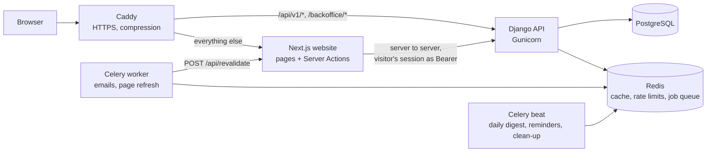

# Fundup Club — Backend

As of 2026-10-03. The backend is built: a Django API in [`backend/`](../backend/) that owns every account, application, event, article, subscriber and message, and enforces every rule. This doc is the reference for how it fits together. Running it in production is covered in [deployment.md](deployment.md); what each page does is in [pages-and-features.md](pages-and-features.md); working on the backend itself is in [backend/README.md](../backend/README.md).

## Architecture

```mermaid
flowchart LR
  B[Browser] --> C[Caddy<br/>HTTPS, compression]
  C -->|everything else| N[Next.js website<br/>pages + Server Actions]
  C -->|/api/v1/*, /backoffice/*| D[Django API<br/>Gunicorn]
  N -->|server to server,<br/>visitor's session as Bearer| D
  D --> P[(PostgreSQL)]
  D --> R[(Redis<br/>cache, rate limits, job queue)]
  W[Celery worker<br/>emails, page refresh] --> R
  S[Celery beat<br/>daily digest, reminders, clean-up] --> R
  W -->|POST /api/revalidate| N
```

- **The website never touches the database.** Pages and Server Actions call the API through one client, [src/lib/api.ts](../src/lib/api.ts), over the private Docker network (`BACKEND_URL`). The browser only ever talks to the website (and, for Google sign-in, to Google).
- **Identity comes from the session.** Signing in returns a random token in the `vcs_session` cookie (httpOnly, `SameSite=Lax`, `Secure` in production). The website copies it onto its own response and forwards it as `Authorization: Bearer …` on every signed-in call. [src/proxy.ts](../src/proxy.ts) sends visitors with no cookie at all from `/dashboard…` and `/admin…` to `/login?next=<page>`, and tells signed-in pages their own path so an ended session can do the same; it's a shortcut only, the API still answers every call. A 401 from `/me` means signed out; any other refusal there (a 429, say) shows the error page rather than the sign-in form. The API stores only the token's SHA-256 hash, so signing out, a password reset or a back-office "sign out everywhere" ends it for good.
- **Every rule is enforced by the API**, inside one transaction holding the application's row lock (`SELECT … FOR UPDATE`): the edit lock, "complete before submit", the 100% equity cap and "two reviewers can't both decide". The website keeps its copies of the rules in `progress.ts`, `decisions.ts`, `types.ts` and `validation.ts` only to show progress, hide invalid buttons and validate sign-in forms early. **If you change a rule, change it in both places**; the API's copy (`backend/apps/applications/rules.py`, `backend/apps/core/validation.py`) is the one that counts.
- **Public pages are static (ISR).** The landing page, `/events`, `/newsletter` and `/demo-day` are served from Next's cache, refreshed every minute, and the moment the API reports a change (see *Caching and refresh*). Event, article and startup pages are rendered on first visit and cached the same way.
- **Emails are sent in the background** by the Celery worker, after the database transaction commits, with retries. Without an SMTP server configured they're printed to the worker's log.

### Code map

| Where | What |
| --- | --- |
| [backend/config/settings.py](../backend/config/settings.py) | Every setting, all from environment variables (`.env.example` lists them) |
| [backend/apps/accounts/](../backend/apps/accounts/) | Users, sessions, password reset, email verification, Google sign-in, back-office user admin |
| [backend/apps/applications/](../backend/apps/applications/) | The application: `rules.py` (option lists, required answers, decisions, field parsing), `services.py` (every change, atomic), `payloads.py` (JSON shapes, the public allowlist), `queue.py` (review queue in SQL), `export.py` (CSV), `notifications.py`, `tasks.py` (daily digest) |
| [backend/apps/content/](../backend/apps/content/) | Events and registrations, newsletter issues and subscribers, contact messages; `seed_content` loads the launch content |
| [backend/apps/core/](../backend/apps/core/) | Error format, rate limits, client IP, request ids, JSON logs, health checks, email queue, page-refresh hook |
| [src/lib/api.ts](../src/lib/api.ts) | The website's only door to the API |
| [src/lib/auth.ts](../src/lib/auth.ts) | Sign-in, sign-up, sessions, password reset, email verification, Google sign-in |
| [src/lib/application/dal.ts](../src/lib/application/dal.ts), [review.ts](../src/lib/application/review.ts), [public.ts](../src/lib/application/public.ts) | Founder, reviewer and public reads |
| [src/lib/events.ts](../src/lib/events.ts), [newsletter.ts](../src/lib/newsletter.ts), [contact.ts](../src/lib/contact.ts) | Events, the newsletter and the contact form |
| [src/app/dashboard/actions.ts](../src/app/dashboard/actions.ts), [src/app/admin/actions.ts](../src/app/admin/actions.ts) | The forms' Server Actions: send what was typed to the API, show what it answers |

## API reference

Base path `/api/v1`. JSON in and out. Interactive docs (OpenAPI) at `/api/v1/docs/` when `DJANGO_DEBUG=true` or `API_DOCS_PUBLIC=true`.

**Authentication:** the `vcs_session` cookie (browsers) or `Authorization: Bearer <token>` (the website's server, other clients). A cookie-authenticated request that changes data must come from the site itself (its `Origin` or `Referer` must be `SITE_URL` or in `CSRF_TRUSTED_ORIGINS`); Bearer requests can't be forged cross-site.

**Errors:**

| Status | Body | Meaning |
| --- | --- | --- |
| 401 | `{ message }` | Not signed in, or the session ended |
| 404 | `{ message }` | Not found — and also *not allowed*: reviewer-only resources answer 404 to everyone else |
| 409 | `{ message }` | Locked, or the status changed underneath you |
| 422 | `{ message, errors?: { field: message } }` | Validation, keyed by the form field names, in the forms' own words |
| 429 | `{ message, retryAfter }` | Rate limited (`Retry-After` header too) |

### Accounts

| Method | Path | Body | Success |
| --- | --- | --- | --- |
| POST | `/auth/register` | `{ name, email, password, terms: true }` | 201 `{ user }` + session cookie; sends the verification email |
| POST | `/auth/login` | `{ email, password, remember? }` | 200 `{ user }` + cookie (30 days with `remember`, else until the browser closes, server-side 24 h). Wrong email or password: one generic 401 |
| POST | `/auth/logout` | — | 204; the session is revoked |
| POST | `/auth/password-reset` | `{ email }` | 202, always the same, registered or not; the link is emailed in the background |
| POST | `/auth/password-reset/confirm` | `{ token, password }` | 200 `{ user }` + cookie (signed in); ends every other session; 400 for an invalid, used or expired link (30 minutes, single use) |
| POST | `/auth/verify-email` | `{ token }` | 200 `{ user }`; 400 if invalid or expired (3 days) |
| POST | `/auth/verify-email/resend` | — (signed in) | 202 |
| POST | `/auth/google` | `{ code }` | 200 `{ user }` + cookie. Exchanges the code Google sent to `SITE_URL/api/auth/callback/google`; joins an existing account with the same address. If that account's address was never confirmed, its password, sessions and emailed links are cancelled first, so an account registered in advance by someone else can't be kept by them |
| GET | `/me` | — | `{ user: { id, email, name, role, isReviewer, emailVerified, hasPassword, createdAt } }` |
| PATCH | `/me` | `{ name }` | 200 `{ user }` (the website's `/dashboard/account`) |
| POST | `/me/password` | `{ currentPassword, newPassword }` | 204; ends every other session. `currentPassword` is ignored for accounts without a password (Google-only), which this sets one for. Shares the sign-in rate limit |

### The founder's application

Always the signed-in founder's own; no endpoint takes a user id. Responses carry the whole application (the `Application` type in `types.ts`, plus `progress`) and **never** reviewer data.

| Method | Path | Body | Notes |
| --- | --- | --- | --- |
| GET | `/me/application` | — | Created as a blank draft on first visit |
| PATCH | `/me/application/profile` | Profile fields | Only the fields sent change. 409 while locked, 422 with `errors` |
| PATCH | `/me/application/startup` | Startup fields | Numbers may be strings with commas (`"1,200"`); links get `https://` |
| PATCH | `/me/application/team` | `{ workedTogether, whyUs, hiringNeeds }` | |
| POST | `/me/application/team/members` | Member fields | 201 `{ application, memberId }`; 422 `errors.equity` past 100% |
| PATCH | `/me/application/team/members/:id` | Member fields | Merged into the stored member, then checked |
| DELETE | `/me/application/team/members/:id` | — | 409 for the last remaining member |
| PUT / DELETE | `/me/application/logo`, `/me/application/photo` | multipart `file` | The startup's logo, the founder's photo. PNG, JPEG or WebP up to 5 MB, stored as a WebP of at most 512 × 512 (photos cropped square). 422 `errors.file`; 409 while locked. The application then carries `logo` and `photo`: addresses under `/api/v1/media/`, or `""` |
| POST | `/me/application/submit` | `{ confirm: true }` | 422 `{ message, missing: [...] }` with every answer still missing |
| POST | `/me/application/withdraw` | — | Only while Submitted; 409 once review has started, or (another message) when it isn't submitted |

### Review panel (reviewers only; everyone else gets 404)

| Method | Path | Body | Notes |
| --- | --- | --- | --- |
| GET | `/admin/applications` | `?status&q&stage&industry&mine=1&sort&page&pageSize` | `{ rows, counts, summary, page, pages, pageSize, total, filters }`; filtered, counted, sorted and paged in SQL (50 per page) |
| GET | `/admin/applications/:id` | — | The full record, with `review` (assignee, scorecards, notes) |
| POST | `/admin/applications/:id/decisions` | `{ decision, message }` | Checked against the stored status: the second reviewer gets 409 "Someone got there first" |
| PUT / DELETE | `/admin/applications/:id/assignee` | — | Assign to yourself / unassign |
| PUT | `/admin/applications/:id/scorecard` | `{ scores: { problem: 4, … }, recommendation, summary }` (or the form's `score-problem` fields) | Replaces only your own card; recomputes the team score |
| POST | `/admin/applications/:id/notes` | `{ body }` | 201 |
| GET | `/admin/export.csv` | — | Every application, 33 columns, formula cells neutralised, UTF-8 BOM, `no-store` |

### Public

| Method | Path | Notes |
| --- | --- | --- |
| GET | `/startups` | Every submitted startup as directory cards, newest first, each with its `logo` and `founder: { name, role, photo }` (the applicant). Drafts never appear |
| GET | `/media/startups/<name>.webp`, `/media/founders/<name>.webp` | An uploaded logo or photo. Names are random and a file never changes, so they're served with `Cache-Control: immutable`. In production Caddy serves these straight from the `media` volume; the API's own view is what development uses |
| GET | `/startups/:slug` | One startup's public page |
| GET | `/events?when=upcoming\|past\|all` | Published events in the `SummitEvent` shape; venue and joining link never included |
| GET | `/events/:slug` | |
| POST | `/events/:slug/registrations` | `{ name, email, company }` → 201 new, 200 `existing: true`; 409 ended or full; emails a confirmation with the joining details and a calendar invite |
| GET | `/newsletter/posts`, `/newsletter/posts/:slug` | Issues (the list without their text) |
| POST | `/newsletter/subscribers` | `{ email, source }` → 201 `{ status: "new" }` or 200 `{ status: "existing" }`; welcome email with an unsubscribe link |
| POST | `/newsletter/unsubscribe` | `{ token }` from that link (it names the subscriber by id, never by address) |
| POST | `/contact` | `{ name, email, company, topic, message }` → 201; emailed to `SUPPORT_EMAILS` with the sender as reply-to |
| GET | `/options` | Every option list the forms use, the contact form's topics (`contactTopics`) included |
| GET | `/health`, `/health/ready` | Liveness; readiness checks the database and Redis |

The public forms take the same hidden `website` field as the website's forms: if a bot fills it in, the API answers as if it worked and stores nothing.

## Data model

PostgreSQL, created by Django migrations (`backend/apps/*/migrations/`).

| Table | Holds | Notes |
| --- | --- | --- |
| `accounts_user` | Email (unique, stored lower-case), name, Argon2 password hash (none for Google-only accounts), role (`founder`/`reviewer`), Google id, `email_verified_at`, `terms_accepted_at`, back-office flags | **Reviewer access needs the role *and* an address the user confirmed themselves** (the back office can set the role, never the confirmation) |
| `accounts_authsession` | SHA-256 of the session token, expiry, revoked-at, last used, IP, user agent | Purged 30 days after expiry |
| `accounts_usertoken` | SHA-256 of emailed tokens (password reset, email verification), expiry, used-at | Single use; a new one cancels the old |
| `applications_application` | Status, `profile` / `startup` / `team` (JSON, read and written as whole sections), assignee, public `slug` (and `slug_source`, the name it was made from), `public_snapshot` (the sections as last submitted), timestamps, including `first_submitted_at` | Copies of `startup_name`, `stage`, `industry`, `founder_name`, `tagline` and `team_score` are kept in columns for the queue's filters and sorting |
| *(files)* `media/startups/`, `media/founders/` | Logos and founder photos, named by `applications_application.logo` / `.photo` | The `media` Docker volume. A replaced or removed image, and those of a deleted account, are deleted from it |
| `applications_applicationevent` | The founder-visible timeline: who (`founder`/`support`), kind, title, message | `actor` is audit-only and never sent to founders |
| `applications_scorecard` | One per reviewer per application: five 1–5 scores, recommendation, summary | Database constraints enforce both |
| `applications_internalnote` | Reviewer-only notes | Kept when their author's account is deleted (shown as "Former reviewer") |
| `content_event`, `content_agendaitem`, `content_eventregistration` | Events (edited in the back office), their agenda, registrations | One registration per email per event; capacity enforced |
| `content_post` | Newsletter issues; the text is written in a simple format (blank lines between paragraphs, `## ` or `### ` headings, `- ` or `* ` lists, `1. ` numbered lists, `> ` quotes whose last line is the credit only when it starts with `—`, `--` or `- `), read line by line, so a list or quote may follow a heading or a sentence directly | An issue dated in the future stays hidden until that date (UTC) |
| `content_seedrecord` | That the launch content was loaded | `seed_content --if-empty` loads it once per database, never again, even if every placeholder is later deleted |
| `content_subscriber`, `content_contactmessage` | Subscribers (with unsubscribe date), contact messages (with a "handled" date) | |

`profile.email` is never stored in the application: it always comes from the account. The old option value `"VC Summit event"` is shown as `"Fundup Club event"`.

**Public addresses:** a startup's slug is fixed the first time it's submitted (`ledgerly`; a second startup of the same name gets `ledgerly-2`), and only re-made if the startup is renamed and resubmitted, so shared links keep working. An address fixed by hand in the back office is kept the same way, until the next rename. Accented letters are folded (`Café Ölmo` → `cafe-olmo`); a name with no Latin letters at all (Arabic, Chinese, emoji…) gets `startup-` and 8 characters of the application's id. The website's copy of the rule is `slugify` in [src/lib/application/directory.ts](../src/lib/application/directory.ts).

**What the directory shows:** the answers as last submitted (`public_snapshot`, taken at every submission), so a founder rewriting their application after "changes requested" doesn't publish a half-finished draft; the status, dates, logo and photo are always current. The "Applied" date and the newest-first order use the first submission, so a resubmission doesn't look new. Startups of deactivated accounts are left out.

## Rules the backend enforces

Each has an automated test (`backend/tests/`).

1. **Identity comes from the session.** Founder endpoints never take a user id. *(test_founders_only_ever_see_their_own_application)*
2. **Reviewer data never reaches founders.** Founder responses are built without `review`, actor ids or reviewer names. *(test_founder_payloads_never_contain_reviewer_data)*
3. **Founder saves preserve reviewer data.** Reviewer data lives in other tables and columns. *(test_founder_saves_leave_reviewer_data_untouched)*
4. **Edit lock:** founders change answers only in Draft or Changes requested; nothing is written otherwise. *(test_saves_are_refused_while_with_the_review_team)*
5. **Submit only when complete:** the 21 required answers with their minimum lengths. *(test_submitting_with_missing_answers_is_refused, test_short_answers_do_not_count)*
6. **Status changes follow the decision table**, re-checked on the locked row. *(test_two_reviewers_deciding_at_once_exactly_one_wins)*
7. **Equity ≤ 100%**, on the locked row, with 33.3 + 33.3 + 33.4 counting as 100. *(test_two_member_saves_can_not_push_equity_past_100)*
8. **Reviewer endpoints answer 404 to everyone else**, the export too. *(test_non_reviewers_get_404_everywhere_in_the_panel)*
9. **Password reset never reveals who is registered.** *(test_password_reset_answers_the_same_for_known_and_unknown_emails)*
10. **CSV export neutralises formulas.** *(test_csv_export_escapes_and_neutralises_formulas)*
11. **Cross-site requests can't use a visitor's cookie** to change data. *(test_cookie_session_writes_must_come_from_the_site)*
12. **The public directory is an allowlist:** no emails, phones, equity, money, deck, review messages. *(test_submitted_startups_are_listed_without_private_fields)*
13. **Public LinkedIn links go to LinkedIn**, not anywhere that mentions it. *(test_profile_validation_messages)*
14. **Answers mean what the founder saw:** line breaks count once (browsers send two characters), and numbers are capped at 10¹² (whole numbers for people counts), so a value can't be stored that the form can't send back. *(test_line_breaks_count_once_and_are_stored_as_newlines, test_startup_validation_messages)*
15. **Only a decision changes the public directory**; assignments, scorecards and notes leave its cache alone. *(test_only_decisions_refresh_the_public_directory)*
16. **Uploads are never stored as sent.** Every image is decoded, resized and re-encoded as WebP; anything that isn't a PNG, JPEG or WebP image is refused, and media addresses only match the names the API itself gives out. *(test_files_that_are_not_images_are_refused, test_made_up_media_addresses_are_not_found)*

## Notifications

All sent by the Celery worker after the change commits; a failed send is retried 6 times, after 30 s, 1, 2, 4, 8 and 16 minutes (about 31 minutes in all), then logged and dropped. Without `EMAIL_HOST` they're written to the worker's log instead (`docker compose logs worker`). Templates: [backend/templates/emails/](../backend/templates/emails/) (plain text, wrapped in one HTML layout that never turns the text into links: names and messages typed by founders or the public stay plain text, and only the email's own buttons and listed links are clickable). Subjects are always one line, and single-line fields (names, companies, startup name, tagline…) refuse line breaks ("Use a single line."), so no email can be dropped by a header the mail library refuses.

| Trigger | To | Email |
| --- | --- | --- |
| Account created | Founder | Confirm your email (link to `/verify-email`) |
| Made a reviewer in the back office (address not yet confirmed) | The new reviewer | Confirm your email to review, in reviewer wording |
| Address changed in the back office | Account holder, at the new address | Confirm your new email; until then the account counts as unconfirmed (no review panel), and any emailed links to the old address stop working |
| Password reset requested | Account holder, if the account exists | Single-use link to `/reset-password` (30 minutes) |
| Password reset or changed | Account holder | "Your password was changed", with a button to reset it if that wasn't them |
| Application submitted or resubmitted | Founder | Confirmation; review starts within 5 working days |
| Application submitted or resubmitted | Each reviewer (one email each) | New item, with a link to it in the panel |
| Any decision | Founder | What happened, the reviewer's message, a link to the dashboard. Replies go to the first `SUPPORT_EMAILS` address |
| Daily at 08:00 UTC | Each reviewer | Applications waiting 5+ days: the count of all of them, the 50 longest-waiting listed with links |
| Contact form | `SUPPORT_EMAILS` (or, if empty, each reviewer separately) | The message, reply-to the sender |
| Newsletter sign-up | Subscriber | Welcome, with an unsubscribe link |
| Event registration | Guest | Confirmation with the venue or joining link and a calendar invite (`invite.ics`, `METHOD:PUBLISH`, with the joining link for online events). It promises a reminder only to guests who registered 24 hours or more ahead |
| Joining link (online) or venue (in person) filled in after people registered | Every guest of that upcoming event, once | The link or the venue |
| The day before an event | Guests who registered 24 hours or more ahead | Reminder with the joining details, saying "Today" or "Tomorrow" in the event's time zone (checked hourly) |

Times in emails are shown in the event's time zone, with the end date when an event runs past midnight; zones without a name show as an offset ("UTC−03:00").

## Caching and refresh

- **The API** caches the startup directory, events and articles in Redis for 5 minutes, and drops them the moment one changes. Only things that exist are cached by address: a made-up slug is looked up each time (the website caches its 404 for a minute), so random addresses can't fill Redis and push out the rate-limit counters.
- **The website** caches its reads of that public data for a minute (`fetch` tags `startups`, `events`, `newsletter`), and its public pages are static (ISR, `revalidate = 60`).
- **On change**, once per database transaction whatever it changed (an event and its agenda rows are one refresh), the API's worker calls the website's [`/api/revalidate`](../src/app/api/revalidate/route.ts) with the tag (authorised by `REVALIDATE_SECRET`), so an event edited in the back office or a decided application shows within seconds. Founder submissions and withdrawals, and reviewer decisions, refresh the `startups` tag themselves; assignments, scorecards and notes don't touch it (on either side: the API's directory cache ignores saves of review-only columns, `REVIEW_ONLY` in `applications/signals.py`).
- **The API's refreshes are stale-while-revalidate** (`revalidateTag(tag, "max")` in the route): the tag's pages are marked out of date; the next visitor gets the old copy while a new one renders, and everyone after sees the change. If the API can't be reached for that render (a deploy, a restart), the old copy stays. (Expiring tags outright, `{ expire: 0 }`, made those pages answer 500 for as long as the API was down.) **The website's own actions** (a founder submitting or withdrawing, a reviewer deciding) use `updateTag("startups")`, which expires at once so the person sees their own change on the next page they open; the API has just answered them, so it's up to render it.
- **Pages rendered after the build stay in memory** (`experimental.isrFlushToDisk: false` in `next.config.ts`; an LRU of `cacheMaxMemorySize`, 50 MB by default), so requests for endless made-up addresses can't fill the website container's disk. A restart starts from the build's copies again.
- **Uploaded logos and photos** aren't optimised by the website at all: the API already made them small WebP files, so pages point straight at `/api/v1/media/…` (`unoptimized` on the `<Image>`). In development, where there is no Caddy, `next.config.ts` passes that path on to the API.
- **Optimised images** (`/_next/image`) are cached in the website's memory, up to 64 MB, by [cache-handler.mjs](../cache-handler.mjs) (`cacheHandler` and `images.customCacheHandler` in `next.config.ts`). Next's own image cache is on disk and is switched off by `isrFlushToDisk: false`; without the handler every image request re-encoded its image (about a second of CPU each), which stalled the whole website under load. Everything else goes through Next's built-in cache unchanged.
- **At build time** the API isn't reachable, so public pages are prerendered without data (`BUILDING` in `lib/api.ts`) and [scripts/expire-prerendered.mjs](../scripts/expire-prerendered.mjs) backdates them; the first visit after a deploy renders them with live data. So that this first visit doesn't race the API (after a host reboot, Docker's restart policy ignores `depends_on`), the website's container waits up to 90 seconds for `/api/v1/health/ready` before starting ([scripts/start.mjs](../scripts/start.mjs); `API_WAIT_SECONDS`). If the API is down later, the last good copy keeps being served.
- Signed-in pages (`/dashboard`, `/admin`) are always rendered per request and never cached.

## Rate limits

Counted per client address in Redis, so every API worker shares one count. The address is the visitor's, passed on by Caddy and the website (`X-Forwarded-For` is only believed from the private network).

| Scope | Limit |
| --- | --- |
| Sign-in (and password change) | 10 per minute per address. Failed attempts only: 5 per account per address per 15 minutes, and 50 per account from anywhere per hour. A success clears the visitor's count; a password reset clears the account's |
| Back-office sign-in | 10 failed attempts per address per 15 minutes |
| Sign-up | 10 per hour per address |
| Password reset | 5 requests per hour per address; at most 3 emails per hour per inbox (past that the request still answers 202 and the latest link keeps working, so nobody can block or flood someone's reset) |
| Contact form / newsletter / event registration | 10 / 20 / 30 per hour per address |
| Everything else | 300 per minute anonymous, 600 per minute signed in |

The website's own reads of public data (from the private network, with no visitor address) aren't limited: they fill a shared cache, so they can't carry a visitor's address, and limiting them would let anyone take every public page down by requesting unknown slugs.

## Environment variables

All in [.env.example](../.env.example), with what each one does. The ones you must set for production: `SITE_URL`, `SITE_ADDRESS`, `DJANGO_SECRET_KEY`, `POSTGRES_PASSWORD`, `REVALIDATE_SECRET`, and the `EMAIL_*` settings. The API answers to the domain in `SITE_URL` and to its internal names automatically; `DJANGO_ALLOWED_HOSTS` only adds extra names. `COOKIE_SECURE` defaults to `true`. Google sign-in needs `GOOGLE_CLIENT_ID` and `GOOGLE_CLIENT_SECRET`, with `<SITE_URL>/api/auth/callback/google` as an authorised redirect URI.

The website reads `BACKEND_URL` (where the API is; `http://backend:8000` in Docker), `GOOGLE_CLIENT_ID`, `REVALIDATE_SECRET`, `COOKIE_SECURE`, and `NEXT_PUBLIC_SITE_URL` (set at build time from `SITE_URL`).

## Tests

`cd backend && pytest` runs 248 tests against a real PostgreSQL (row locks matter), including the concurrency tests that race two requests on separate connections, and `npm run test:e2e` runs 69 end-to-end tests against a running stack: every endpoint over HTTP, and the website in a browser. Details: [testing.md](testing.md). The list that was checked by hand before the backend existed is now automated:

- [x] A founder can't read or change another founder's application.
- [x] No founder payload contains scorecards, notes, assignee or `review`.
- [x] A founder save leaves the assignee, scorecards and notes untouched.
- [x] Saves are refused (and nothing is written) while the status is `submitted`, `in_review`, `accepted` or `declined`.
- [x] Submitting with any required answer missing is refused.
- [x] Two concurrent member saves can't push total equity past 100%.
- [x] Two concurrent decisions: exactly one succeeds, the other gets a conflict.
- [x] Non-reviewers get 404 from every review endpoint and the export.
- [x] Password reset returns the same response for registered and unknown emails.
- [x] CSV cells starting with `=`, `+`, `-` or `@` come out prefixed with `'`.

## Still to decide before launch

- Whether applicants must opt in to the public directory (the form has no such consent today), and whether declined applications should be listed at all.
- The real launch content: the events and newsletter issues loaded by `seed_content` are the site's original placeholders, now editable in the back office.
- An email provider (any SMTP service) and a verified sending domain (SPF, DKIM, DMARC), so emails don't land in spam.
