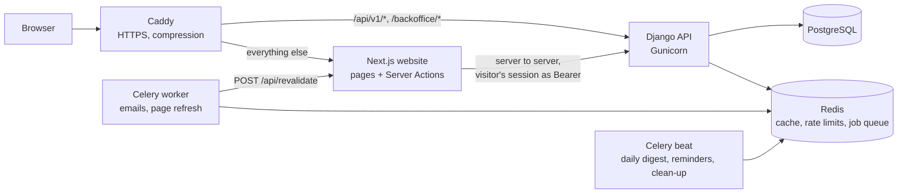

# Fundup Club — Backend

As of 2026-10-03. The backend is built: a Django API in [`backend/`](../backend/) that owns every account, application, event, article, subscriber and message, and enforces every rule. This doc is the reference for how it fits together. Running it in production is covered in [deployment.md](deployment.md); what each page does is in [pages-and-features.md](pages-and-features.md); working on the backend itself is in [backend/README.md](../backend/README.md).

## Architecture

```mermaid
flowchart LR
  B[Browser] --> C[Caddy<br/>HTTPS, compression]
  C -->|everything else| N[Next.js website<br/>pages + Server Actions]
  C -->|/api/v1/*, /backoffice/*| D[Django API<br/>Gunicorn]
  N -->|server to server,<br/>visitor's session as Bearer| D
  D --> P[(PostgreSQL)]
  D --> R[(Redis<br/>cache, rate limits, job queue)]
  W[Celery worker<br/>emails, page refresh] --> R
  S[Celery beat<br/>daily digest, reminders, clean-up] --> R
  W -->|POST /api/revalidate| N
```

- **The website never touches the database.** Pages and Server Actions call the API through one client, [src/lib/api.ts](../src/lib/api.ts), over the private Docker network (`BACKEND_URL`). The browser only ever talks to the website (and, for Google sign-in, to Google).
- **Identity comes from the session.** Signing in returns a random token in the `vcs_session` cookie (httpOnly, `SameSite=Lax`, `Secure` in production). The website copies it onto its own response and forwards it as `Authorization: Bearer …` on every signed-in call. The API stores only the token's SHA-256 hash, so signing out, a password reset or a back-office "sign out everywhere" ends it for good.
- **Every rule is enforced by the API**, inside one transaction holding the application's row lock (`SELECT … FOR UPDATE`): the edit lock, "complete before submit", the 100% equity cap and "two reviewers can't both decide". The website keeps its copies of the rules in `progress.ts`, `decisions.ts`, `types.ts` and `validation.ts` only to show progress, hide invalid buttons and validate sign-in forms early. **If you change a rule, change it in both places**; the API's copy (`backend/apps/applications/rules.py`, `backend/apps/core/validation.py`) is the one that counts.
- **Public pages are static (ISR).** The landing page, `/events`, `/newsletter` and `/demo-day` are served from Next's cache, refreshed every minute, and the moment the API reports a change (see *Caching and refresh*). Event, article and startup pages are rendered on first visit and cached the same way.
- **Emails are sent in the background** by the Celery worker, after the database transaction commits, with retries. Without an SMTP server configured they're printed to the worker's log.

### Code map

| Where | What |
| --- | --- |
| [backend/config/settings.py](../backend/config/settings.py) | Every setting, all from environment variables (`.env.example` lists them) |
| [backend/apps/accounts/](../backend/apps/accounts/) | Users, sessions, password reset, email verification, Google sign-in, back-office user admin |
| [backend/apps/applications/](../backend/apps/applications/) | The application: `rules.py` (option lists, required answers, decisions, field parsing), `services.py` (every change, atomic), `payloads.py` (JSON shapes, the public allowlist), `queue.py` (review queue in SQL), `export.py` (CSV), `notifications.py`, `tasks.py` (daily digest) |
| [backend/apps/content/](../backend/apps/content/) | Events and registrations, newsletter issues and subscribers, contact messages; `seed_content` loads the launch content |
| [backend/apps/core/](../backend/apps/core/) | Error format, rate limits, client IP, request ids, JSON logs, health checks, email queue, page-refresh hook |
| [src/lib/api.ts](../src/lib/api.ts) | The website's only door to the API |
| [src/lib/auth.ts](../src/lib/auth.ts) | Sign-in, sign-up, sessions, password reset, email verification, Google sign-in |
| [src/lib/application/dal.ts](../src/lib/application/dal.ts), [review.ts](../src/lib/application/review.ts), [public.ts](../src/lib/application/public.ts) | Founder, reviewer and public reads |
| [src/lib/events.ts](../src/lib/events.ts), [newsletter.ts](../src/lib/newsletter.ts), [contact.ts](../src/lib/contact.ts) | Events, the newsletter and the contact form |
| [src/app/dashboard/actions.ts](../src/app/dashboard/actions.ts), [src/app/admin/actions.ts](../src/app/admin/actions.ts) | The forms' Server Actions: send what was typed to the API, show what it answers |

## API reference

Base path `/api/v1`. JSON in and out. Interactive docs (OpenAPI) at `/api/v1/docs/` when `DJANGO_DEBUG=true` or `API_DOCS_PUBLIC=true`.

**Authentication:** the `vcs_session` cookie (browsers) or `Authorization: Bearer <token>` (the website's server, other clients). A cookie-authenticated request that changes data must come from the site itself (its `Origin` or `Referer` must be `SITE_URL` or in `CSRF_TRUSTED_ORIGINS`); Bearer requests can't be forged cross-site.

**Errors:**

| Status | Body | Meaning |
| --- | --- | --- |
| 401 | `{ message }` | Not signed in, or the session ended |
| 404 | `{ message }` | Not found — and also *not allowed*: reviewer-only resources answer 404 to everyone else |
| 409 | `{ message }` | Locked, or the status changed underneath you |
| 422 | `{ message, errors?: { field: message } }` | Validation, keyed by the form field names, in the forms' own words |
| 429 | `{ message, retryAfter }` | Rate limited (`Retry-After` header too) |

### Accounts

| Method | Path | Body | Success |
| --- | --- | --- | --- |
| POST | `/auth/register` | `{ name, email, password, terms: true }` | 201 `{ user }` + session cookie; sends the verification email |
| POST | `/auth/login` | `{ email, password, remember? }` | 200 `{ user }` + cookie (30 days with `remember`, else until the browser closes, server-side 24 h). Wrong email or password: one generic 401 |
| POST | `/auth/logout` | — | 204; the session is revoked |
| POST | `/auth/password-reset` | `{ email }` | 202, always the same, registered or not; the link is emailed in the background |
| POST | `/auth/password-reset/confirm` | `{ token, password }` | 200 `{ user }` + cookie (signed in); ends every other session; 400 for an invalid, used or expired link (30 minutes, single use) |
| POST | `/auth/verify-email` | `{ token }` | 200 `{ user }`; 400 if invalid or expired (3 days) |
| POST | `/auth/verify-email/resend` | — (signed in) | 202 |
| POST | `/auth/google` | `{ code }` | 200 `{ user }` + cookie. Exchanges the code Google sent to `SITE_URL/api/auth/callback/google`; joins an existing account with the same verified address |
| GET | `/me` | — | `{ user: { id, email, name, role, isReviewer, emailVerified, hasPassword, createdAt } }` |
| PATCH | `/me` | `{ name }` | 200 `{ user }` |
| POST | `/me/password` | `{ currentPassword, newPassword }` | 204; ends every other session |

### The founder's application

Always the signed-in founder's own; no endpoint takes a user id. Responses carry the whole application (the `Application` type in `types.ts`, plus `progress`) and **never** reviewer data.

| Method | Path | Body | Notes |
| --- | --- | --- | --- |
| GET | `/me/application` | — | Created as a blank draft on first visit |
| PATCH | `/me/application/profile` | Profile fields | Only the fields sent change. 409 while locked, 422 with `errors` |
| PATCH | `/me/application/startup` | Startup fields | Numbers may be strings with commas (`"1,200"`); links get `https://` |
| PATCH | `/me/application/team` | `{ workedTogether, whyUs, hiringNeeds }` | |
| POST | `/me/application/team/members` | Member fields | 201 `{ application, memberId }`; 422 `errors.equity` past 100% |
| PATCH | `/me/application/team/members/:id` | Member fields | Merged into the stored member, then checked |
| DELETE | `/me/application/team/members/:id` | — | 409 for the last remaining member |
| POST | `/me/application/submit` | `{ confirm: true }` | 422 `{ message, missing: [...] }` with every answer still missing |
| POST | `/me/application/withdraw` | — | Only while Submitted; 409 once review has started |

### Review panel (reviewers only; everyone else gets 404)

| Method | Path | Body | Notes |
| --- | --- | --- | --- |
| GET | `/admin/applications` | `?status&q&stage&industry&mine=1&sort&page&pageSize` | `{ rows, counts, summary, page, pages, pageSize, total, filters }`; filtered, counted, sorted and paged in SQL (50 per page) |
| GET | `/admin/applications/:id` | — | The full record, with `review` (assignee, scorecards, notes) |
| POST | `/admin/applications/:id/decisions` | `{ decision, message }` | Checked against the stored status: the second reviewer gets 409 "Someone got there first" |
| PUT / DELETE | `/admin/applications/:id/assignee` | — | Assign to yourself / unassign |
| PUT | `/admin/applications/:id/scorecard` | `{ scores: { problem: 4, … }, recommendation, summary }` (or the form's `score-problem` fields) | Replaces only your own card; recomputes the team score |
| POST | `/admin/applications/:id/notes` | `{ body }` | 201 |
| GET | `/admin/export.csv` | — | Every application, 33 columns, formula cells neutralised, UTF-8 BOM, `no-store` |

### Public

| Method | Path | Notes |
| --- | --- | --- |
| GET | `/startups` | Every submitted startup as directory cards, newest first. Drafts never appear |
| GET | `/startups/:slug` | One startup's public page |
| GET | `/events?when=upcoming\|past\|all` | Published events in the `SummitEvent` shape; venue and joining link never included |
| GET | `/events/:slug` | |
| POST | `/events/:slug/registrations` | `{ name, email, company }` → 201 new, 200 `existing: true`; 409 ended or full; emails a confirmation with the joining details and a calendar invite |
| GET | `/newsletter/posts`, `/newsletter/posts/:slug` | Issues (the list without their text) |
| POST | `/newsletter/subscribers` | `{ email, source }` → 201 `{ status: "new" }` or 200 `{ status: "existing" }`; welcome email with an unsubscribe link |
| POST | `/newsletter/unsubscribe` | `{ token }` from that link (it names the subscriber by id, never by address) |
| POST | `/contact` | `{ name, email, company, topic, message }` → 201; emailed to `SUPPORT_EMAILS` with the sender as reply-to |
| GET | `/options` | Every option list the forms use |
| GET | `/health`, `/health/ready` | Liveness; readiness checks the database and Redis |

The public forms take the same hidden `website` field as the website's forms: if a bot fills it in, the API answers as if it worked and stores nothing.

## Data model

PostgreSQL, created by Django migrations (`backend/apps/*/migrations/`).

| Table | Holds | Notes |
| --- | --- | --- |
| `accounts_user` | Email (unique, stored lower-case), name, Argon2 password hash (none for Google-only accounts), role (`founder`/`reviewer`), Google id, `email_verified_at`, `terms_accepted_at`, back-office flags | **Reviewer access needs the role *and* a verified address** |
| `accounts_authsession` | SHA-256 of the session token, expiry, revoked-at, last used, IP, user agent | Purged 30 days after expiry |
| `accounts_usertoken` | SHA-256 of emailed tokens (password reset, email verification), expiry, used-at | Single use; a new one cancels the old |
| `applications_application` | Status, `profile` / `startup` / `team` (JSON, read and written as whole sections), assignee, public `slug`, timestamps | Copies of `startup_name`, `stage`, `industry`, `founder_name`, `tagline` and `team_score` are kept in columns for the queue's filters and sorting |
| `applications_applicationevent` | The founder-visible timeline: who (`founder`/`support`), kind, title, message | `actor` is audit-only and never sent to founders |
| `applications_scorecard` | One per reviewer per application: five 1–5 scores, recommendation, summary | Database constraints enforce both |
| `applications_internalnote` | Reviewer-only notes | |
| `content_event`, `content_agendaitem`, `content_eventregistration` | Events (edited in the back office), their agenda, registrations | One registration per email per event; capacity enforced |
| `content_post` | Newsletter issues; the text is written in a simple format (blank lines between paragraphs, `## ` headings, `- ` lists, `> ` quotes) | |
| `content_subscriber`, `content_contactmessage` | Subscribers (with unsubscribe date), contact messages (with a "handled" date) | |

`profile.email` is never stored in the application: it always comes from the account. The old option value `"VC Summit event"` is shown as `"Fundup Club event"`.

**Public addresses:** a startup's slug is fixed the first time it's submitted (`ledgerly`; a second startup of the same name gets `ledgerly-2`), and only re-made if the startup is renamed and resubmitted, so shared links keep working.

## Rules the backend enforces

Each has an automated test (`backend/tests/`).

1. **Identity comes from the session.** Founder endpoints never take a user id. *(test_founders_only_ever_see_their_own_application)*
2. **Reviewer data never reaches founders.** Founder responses are built without `review`, actor ids or reviewer names. *(test_founder_payloads_never_contain_reviewer_data)*
3. **Founder saves preserve reviewer data.** Reviewer data lives in other tables and columns. *(test_founder_saves_leave_reviewer_data_untouched)*
4. **Edit lock:** founders change answers only in Draft or Changes requested; nothing is written otherwise. *(test_saves_are_refused_while_with_the_review_team)*
5. **Submit only when complete:** the 21 required answers with their minimum lengths. *(test_submitting_with_missing_answers_is_refused, test_short_answers_do_not_count)*
6. **Status changes follow the decision table**, re-checked on the locked row. *(test_two_reviewers_deciding_at_once_exactly_one_wins)*
7. **Equity ≤ 100%**, on the locked row, with 33.3 + 33.3 + 33.4 counting as 100. *(test_two_member_saves_can_not_push_equity_past_100)*
8. **Reviewer endpoints answer 404 to everyone else**, the export too. *(test_non_reviewers_get_404_everywhere_in_the_panel)*
9. **Password reset never reveals who is registered.** *(test_password_reset_answers_the_same_for_known_and_unknown_emails)*
10. **CSV export neutralises formulas.** *(test_csv_export_escapes_and_neutralises_formulas)*
11. **Cross-site requests can't use a visitor's cookie** to change data. *(test_cookie_session_writes_must_come_from_the_site)*
12. **The public directory is an allowlist:** no emails, phones, equity, money, deck, review messages. *(test_submitted_startups_are_listed_without_private_fields)*

## Notifications

All sent by the Celery worker after the change commits; failed sends are retried with back-off for about 30 minutes. Templates: [backend/templates/emails/](../backend/templates/emails/) (plain text, wrapped in one HTML layout).

| Trigger | To | Email |
| --- | --- | --- |
| Account created | Founder | Confirm your email (link to `/verify-email`) |
| Password reset requested | Account holder, if the account exists | Single-use link to `/reset-password` (30 minutes) |
| Password reset or changed | Account holder | "Your password was changed" |
| Application submitted or resubmitted | Founder | Confirmation; review starts within 5 working days |
| Application submitted or resubmitted | Each reviewer (one email each) | New item, with a link to it in the panel |
| Any decision | Founder | What happened, the reviewer's message, a link to the dashboard |
| Daily at 08:00 UTC | Each reviewer | Applications waiting 5+ days |
| Contact form | `SUPPORT_EMAILS` (or every reviewer) | The message, reply-to the sender |
| Newsletter sign-up | Subscriber | Welcome, with an unsubscribe link |
| Event registration | Guest | Confirmation with the venue or joining link and a calendar invite (`invite.ics`) |
| The day before an event | Guests who registered more than a day ahead | Reminder (checked hourly) |

## Caching and refresh

- **The API** caches the startup directory, events and articles in Redis for 5 minutes, and drops them the moment one changes.
- **The website** caches its reads of that public data for a minute (`fetch` tags `startups`, `events`, `newsletter`), and its public pages are static (ISR, `revalidate = 60`).
- **On change**, the API's worker calls the website's [`/api/revalidate`](../src/app/api/revalidate/route.ts) with the tag (authorised by `REVALIDATE_SECRET`), so an event edited in the back office or a decided application shows within seconds. Founder and reviewer actions refresh the `startups` tag themselves.
- **At build time** the API isn't reachable, so public pages are prerendered without data (`BUILDING` in `lib/api.ts`) and [scripts/expire-prerendered.mjs](../scripts/expire-prerendered.mjs) backdates them; the first visit after a deploy renders them with live data. If the API is down later, the last good copy keeps being served.
- Signed-in pages (`/dashboard`, `/admin`) are always rendered per request and never cached.

## Rate limits

Counted per client address in Redis, so every API worker shares one count. The address is the visitor's, passed on by Caddy and the website (`X-Forwarded-For` is only believed from the private network).

| Scope | Limit |
| --- | --- |
| Sign-in | 10 per minute per address, 20 per hour per email |
| Sign-up | 10 per hour per address |
| Password reset | 5 per hour per address, 3 per hour per email |
| Contact form / newsletter / event registration | 10 / 20 / 30 per hour per address |
| Everything else | 300 per minute anonymous, 600 per minute signed in |

## Environment variables

All in [.env.example](../.env.example), with what each one does. The ones you must set for production: `SITE_URL`, `SITE_ADDRESS`, `DJANGO_SECRET_KEY`, `POSTGRES_PASSWORD`, `REVALIDATE_SECRET`, and the `EMAIL_*` settings. Google sign-in needs `GOOGLE_CLIENT_ID` and `GOOGLE_CLIENT_SECRET`, with `<SITE_URL>/api/auth/callback/google` as an authorised redirect URI.

The website reads `BACKEND_URL` (where the API is; `http://backend:8000` in Docker), `GOOGLE_CLIENT_ID`, `REVALIDATE_SECRET`, `COOKIE_SECURE`, and `NEXT_PUBLIC_SITE_URL` (set at build time from `SITE_URL`).

## Tests

`cd backend && pytest` runs 121 tests against a real PostgreSQL (row locks matter), including the concurrency tests that race two requests on separate connections. The list that was checked by hand before the backend existed is now automated:

- [x] A founder can't read or change another founder's application.
- [x] No founder payload contains scorecards, notes, assignee or `review`.
- [x] A founder save leaves the assignee, scorecards and notes untouched.
- [x] Saves are refused (and nothing is written) while the status is `submitted`, `in_review`, `accepted` or `declined`.
- [x] Submitting with any required answer missing is refused.
- [x] Two concurrent member saves can't push total equity past 100%.
- [x] Two concurrent decisions: exactly one succeeds, the other gets a conflict.
- [x] Non-reviewers get 404 from every review endpoint and the export.
- [x] Password reset returns the same response for registered and unknown emails.
- [x] CSV cells starting with `=`, `+`, `-` or `@` come out prefixed with `'`.

## Still to decide before launch

- Whether applicants must opt in to the public directory (the form has no such consent today), and whether declined applications should be listed at all.
- The real launch content: the events and newsletter issues loaded by `seed_content` are the site's original placeholders, now editable in the back office.
- An email provider (any SMTP service) and a verified sending domain (SPF, DKIM, DMARC), so emails don't land in spam.
