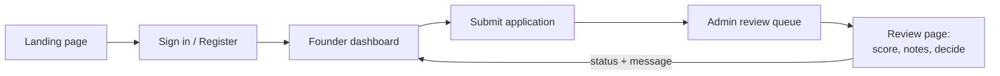
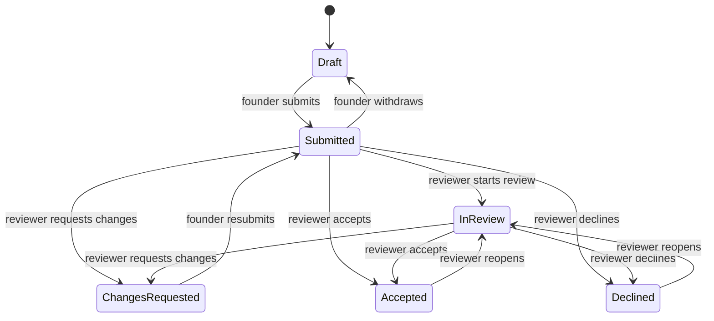

# VC Summit — Pages & Features Reference

As of 2026-09-24. Every page in the app: what it shows, every field and its rules, and how the pieces connect.
Online copy (for sharing and comments): [claude.ai doc](https://claude.ai/code/artifact/2a03db74-a0d6-470e-8f68-c69424658a6b). **This file is the source of truth** — update it in the same commit as any change it describes.

Backend work starts in [backend-integration.md](backend-integration.md).

## Overview

The site has four areas: a public landing page, sign-in pages, a founder dashboard where startups submit their application, and an admin panel where the support team reviews them. It is built with Next.js 16 (App Router), React 19 and Tailwind CSS 4, with no extra dependencies.

| Route | Page | Who uses it | Access |
| --- | --- | --- | --- |
| `/` | Landing page | Everyone | Public |
| `/login` | Sign in | Founders, reviewers | Public |
| `/register` | Create account | New founders | Public |
| `/forgot-password` | Reset password request | Founders | Public |
| `/dashboard` | Founder overview | Founders | Signed in |
| `/dashboard/profile` | Your profile (step 1 of 3) | Founders | Signed in |
| `/dashboard/startup` | Startup details (step 2 of 3) | Founders | Signed in |
| `/dashboard/team` | Team (step 3 of 3) | Founders | Signed in |
| `/dashboard/review` | Review & submit | Founders | Signed in |
| `/admin` | Review queue | Support team | Reviewers only |
| `/admin/applications/[id]` | Review one application | Support team | Reviewers only |
| `/admin/export` | CSV download of all applications | Support team | Reviewers only |

A founder fills in the application in the dashboard and submits it; a reviewer picks it up in the admin queue, scores it and decides; the decision and any message appear back on the founder's dashboard.

**Two parts are still stand-ins:** sign-in is not connected to a real account system, and data is saved to a local file rather than a database. Both are covered in [Data model and storage](#data-model-and-storage) and [backend-integration.md](backend-integration.md).

## Landing page (`/`)

The landing page kept its design on desktop; the mobile version was reworked, cutting its height at 375px from 10,365px to about 6,900px. The desktop header also has a **Sign in** link.

Code: [src/app/page.tsx](../src/app/page.tsx), sections in [src/components/](../src/components/).

| Section | Content | Mobile behaviour |
| --- | --- | --- |
| Header | Logo, 7 section links, Sign in, Request Invitation | Pinned to the top; frosted on scroll; hides scrolling down, returns scrolling up; compact **Apply** button once the hero is out of view |
| Mobile menu | 7 links, Request Invitation, Sign in link | Large tap targets, fade-in, CTA at the bottom clear of the home bar |
| Hero | Headline, sub-copy, Request Invitation, View Summit, 3 stats, Watch the highlights | Full-width CTA, no forced line breaks |
| Stats marquee | 5 scrolling programme stats | Unchanged |
| Accelerator / Portfolio | Intro, featured-founder carousel | Nested card removed; carousel runs edge to edge; controls below the cards |
| Founder letter banner | Link to the founder's letter | Unchanged |
| Six-stage journey | Discover, Build MVP, Validate, Traction, Demo Day / Fundraise, Scale | Swipe row with a 01 / 06 counter instead of six stacked cards |
| CTA band | Apply now, Join a free event | Full-width stacked buttons |
| Alumni stories | Logo marquee, 6 testimonials | Swipe row of equal-height cards |
| Join banner | Apply now, Attend a free event | Full-width buttons, eyebrow on two clean lines |
| FAQ | 5 questions (accordion) | Unchanged |
| Unicorn CTA | Apply now | Full-width button |
| Footer | About text, social links, 5 link groups, legal links | Link groups fold into tap-to-open sections |

Across the page, hover effects only apply to devices with a mouse, so tapped cards don't stay lifted. Anchor links also stop clear of the pinned header.

## Authentication pages

The three pages look and validate like finished pages, but none of them signs anyone in yet: each form ends at a stub in [src/lib/auth.ts](../src/lib/auth.ts) that returns "not connected yet". They share one layout ([src/app/(auth)/layout.tsx](<../src/app/(auth)/layout.tsx>)): a dark brand panel on the left (desktop only) and the form on the right. All three are hidden from search engines (`noindex`). Server actions: [src/app/(auth)/actions.ts](<../src/app/(auth)/actions.ts>).

### Sign in — `/login`

| Field | Form name | Type | Rule |
| --- | --- | --- | --- |
| Email | `email` | email | Required; must look like an email address |
| Password | `password` | password (show/hide toggle) | Required |
| Keep me signed in | `remember` | checkbox | Optional; meant to set how long the session lasts |

- **Continue with Google** button above an "or with email" divider.
- **Forgot password?** carries any email already typed into `/forgot-password?email=…`.
- On success it redirects to `/dashboard` (`AFTER_SIGN_IN`).

### Create account — `/register`

| Field | Form name | Type | Rule |
| --- | --- | --- | --- |
| Full name | `name` | text | Required; 2–80 characters |
| Email | `email` | email | Required; valid format; max 254 characters |
| Password | `password` | password (show/hide toggle) | Required; 8–200 characters; at least one letter and one number |
| Terms of Use and Privacy Policy | `terms` | checkbox | Must be ticked |

- **Sign up with Google** button above the form.
- On success it redirects to `/dashboard`.

### Reset password — `/forgot-password`

| Field | Form name | Type | Rule |
| --- | --- | --- | --- |
| Email | `email` | email | Required; valid format; prefilled from `?email=` |

- After sending, the page switches to **Check your inbox**, with a **Use a different email** button back to the form.
- The confirmation says *"If an account exists for …"*, so the page never reveals which addresses are registered.

### Shared behaviour

- Validation runs on the server ([src/lib/validation.ts](../src/lib/validation.ts)); each error shows under its field and is linked to it for screen readers.
- Typed values survive a failed submit (never the password).
- Inputs are 52px tall with 16px text, which stops iPhones zooming in on focus.
- Google sign-in builds a real Google consent link once `GOOGLE_CLIENT_ID` and `NEXT_PUBLIC_SITE_URL` are set; the return step (`/api/auth/callback/google`) is not built yet.

## Founder dashboard: layout and navigation

Every `/dashboard` page shares one frame ([src/app/dashboard/layout.tsx](../src/app/dashboard/layout.tsx)) showing the application's status and completion. Signed-out visitors are sent to `/login`; the application is created automatically on the first visit.

**Desktop (1024px and up): left sidebar**

- VC Summit logo, linking to the landing page.
- Application card: status badge, percent complete and a progress bar.
- Navigation: Overview, Profile, Startup, Team, Review & submit. Each section shows a green tick when complete, otherwise a count such as `3/6`.
- **Review panel** link, shown only to reviewers.
- "Questions?" card linking to the FAQ.
- User block: initials, name, email and a sign-out button.

**Phones and tablets: sticky header**

- Logo, status badge, and an account menu (name, email, Sign out).
- A swipeable row of section tabs with the same ticks and counts.

**Shared behaviour**

- **Saving:** each section form has a save bar that sticks to the bottom of the screen. It shows *Unsaved changes*, *Saving…*, *Changes saved.* or the error, and the browser warns before closing the tab with unsaved edits.
- **Required fields** are marked `*`. They are only needed to submit; drafts can be saved with gaps.
- **Locked sections:** while the application is with the review team, every section page shows a lock notice and read-only fields.
- **Feedback banner:** when changes are requested, the review team's message appears at the top of every page.
- **Loading:** a skeleton shows while a page loads.
- **Titles and search engines:** pages are titled "… — VC Summit" and hidden from search engines.

Server actions for all dashboard pages: [src/app/dashboard/actions.ts](../src/app/dashboard/actions.ts).

## Overview page (`/dashboard`)

The overview answers two questions for a founder: where the application stands, and what to do next. It greets them by first name ("Welcome back, Alex").

| Panel | What it shows |
| --- | --- |
| Feedback banner | Only when changes are requested: the latest message from the review team, shortened, with a link to read it in full and resubmit |
| Status card | Completion ring (0–100%), status badge, a headline (e.g. "12 answers left before you can submit", "In the review queue"), a short explanation, and one button for the next step |
| Your checklist | Profile, Startup details, Team: each with answered/total, a progress bar and a link to that section |
| Snapshot | Startup name, industry, stage, team size (people · founders), monthly revenue, amount being raised |
| Your stage | The six programme stages, with earlier stages ticked and the current one marked "You are here"; **Change** / **Set stage** links to the stage question |
| What happens next | 4 steps (complete the application, validation & analysis, founder interview, decision), marked done, *Now* or upcoming by status |
| Activity | Timeline of events, newest first; review-team entries are labelled and show their message |

**The status card's button changes with the situation:**

- While editing, with sections incomplete: *Continue: \<next unfinished section\>*.
- While editing, everything answered: *Review & submit*.
- After submitting: *View your application*.

## Profile page (`/dashboard/profile`) — step 1 of 3

The profile has 11 fields; 6 must be answered before the application can be submitted. Fields are grouped into four cards: About you, Where you're based, Commitment, Your story. Saved by `saveProfile`.

| Field | Form name | Input | Needed to submit | Rules when saving |
| --- | --- | --- | --- | --- |
| Full name | `fullName` | text | Yes | Max 80 characters; filled from the account |
| Your role | `title` | text (e.g. "CEO & co-founder") | Yes | Max 80 characters |
| Email | — | read-only | — | Comes from the account; never read from the form |
| Phone | `phone` | tel | No | 7–15 digits, with country code |
| LinkedIn | `linkedin` | url | Yes | Must be a linkedin.com link; `https://` added if missing |
| Years of work experience | `experienceYears` | number | No | Number 0–60 |
| Country | `country` | text | Yes | Max 60 characters |
| City | `city` | text | No | Max 60 characters |
| Commitment | `commitment` | choice: `full-time` / `part-time` | Yes | One of the two options |
| How did you hear about us? | `heardFrom` | dropdown | No | Friend or alumni referral, VC Summit event, Social media, Search, Press or podcast, Other |
| Short bio | `bio` | long text, live counter | Yes, at least 60 characters | Max 1,200 characters |

The *Next: startup details* link sits under the form.

## Startup page (`/dashboard/startup`) — step 2 of 3

This is what the review team validates and analyses: 26 fields in six parts, 12 of them needed to submit. Jump links at the top (Basics, Stage, The idea, Traction, Funding, Materials) scroll to each part. Saved by `saveStartup`.

| Part | Field | Form name | Input | Needed to submit | Rules when saving |
| --- | --- | --- | --- | --- | --- |
| Basics | Startup name | `name` | text | Yes | Max 60 characters |
| Basics | Website | `website` | url | No | Valid link; `https://` added if missing |
| Basics | One-line pitch | `tagline` | text | Yes | Max 120 characters |
| Basics | Industry | `industry` | dropdown | Yes | One of 12 options (below) |
| Basics | Business model | `businessModel` | dropdown | Yes | One of 8 options (below) |
| Basics | Headquarters (country) | `country` | text | Yes | Max 60 characters |
| Basics | Founded | `foundedOn` | month picker (`YYYY-MM`) | No | Can't be in the future |
| Basics | Incorporated? | `incorporated` | choice: `yes` / `no` | No | — |
| Stage | Current stage | `stage` | 6 choice cards | Yes | One of the six stage ids (below) |
| The idea | Problem | `problem` | long text | Yes, at least 80 characters | Max 1,500 characters |
| The idea | Solution | `solution` | long text | Yes, at least 80 characters | Max 1,500 characters |
| The idea | Target customer | `targetCustomer` | long text | Yes | Max 600 characters |
| The idea | Market size | `marketSize` | long text | No | Max 600 characters |
| The idea | Competitors | `competitors` | long text | Yes | Max 1,000 characters |
| The idea | Unfair advantage | `advantage` | long text | Yes, at least 40 characters | Max 1,000 characters |
| Traction | Active users | `activeUsers` | number | No | Positive number; commas allowed |
| Traction | Paying customers | `payingCustomers` | number | No | Positive number |
| Traction | Monthly revenue (USD) | `monthlyRevenue` | number, `$` | No | Positive number |
| Traction | Monthly growth | `growthRate` | number, `%` | No | 0–1,000 |
| Traction | Most important metric | `keyMetric` | text | No | Max 200 characters |
| Funding | Raised to date (USD) | `raisedToDate` | number, `$` | No | Positive number |
| Funding | Currently raising (USD) | `seeking` | number, `$` | No | Positive number |
| Funding | Use of funds | `useOfFunds` | long text | No | Max 1,000 characters |
| Materials | Pitch deck | `deckUrl` | url | Yes | Valid link |
| Materials | Product or demo | `demoUrl` | url | No | Valid link |
| Materials | Founder video (1–2 min) | `videoUrl` | url | No | Valid link |

**Stages** (they mirror the six stages on the landing page):

| # | Id | Label | Meaning |
| --- | --- | --- | --- |
| 1 | `idea` | Discover | Exploring a problem, no product yet |
| 2 | `mvp` | Build MVP | Building the first version |
| 3 | `validation` | Validate | Real users are testing it |
| 4 | `traction` | Traction | Paying customers, growing usage |
| 5 | `fundraising` | Fundraise | Raising a round now |
| 6 | `scaling` | Scale | Hiring and expanding markets |

**Industries:** AI & machine learning, B2B software / SaaS, Climate & energy, Consumer, Deep tech & hardware, E-commerce & retail, Education, Fintech, Health & biotech, Marketplaces, Mobility & logistics, Other.

**Business models:** Subscription (B2B), Subscription (B2C), Marketplace / take rate, Transactional / usage-based, Hardware sales, Advertising, Licensing, Not decided yet.

All option lists live in [src/lib/application/types.ts](../src/lib/application/types.ts); the stored value is the label text shown above (the id for stages and commitment).

## Team page (`/dashboard/team`) — step 3 of 3

The team page has two parts: the list of people, and three questions about the team. To submit it needs at least one founder, how long the founders have worked together, and a "why this team" answer of 60+ characters.

### Team members

The applicant is added automatically as the first founder. Members appear as cards (initials, name, Founder badge, role, equity, commitment, email, LinkedIn) with **Edit** and **Remove**; each opens in place. Saved by `saveMember(memberId | null)`, removed by `removeMember(memberId)`.

| Member field | Form name | Input | Rule |
| --- | --- | --- | --- |
| Name | `name` | text | Required; max 80 characters |
| Role | `role` | text (e.g. "CTO & co-founder") | Required; max 80 characters |
| Email | `email` | email | Optional; valid format |
| LinkedIn | `linkedin` | url | Optional; must be a linkedin.com link |
| Equity | `equity` | number, `%` | Optional; 0–100 |
| Commitment | `commitment` | choice: `full-time` / `part-time` | Optional |
| This person is a co-founder | `isFounder` | checkbox | — |

- **Equity limit:** total equity across the team can't exceed 100%. The check runs on the server inside the save, so two quick saves can't together push past 100%. An **Equity allocated** meter shows the running total.
- **Removing:** asks for confirmation. The last remaining member can't be removed.

### About the team

Saved by `saveTeamDetails`.

| Question | Form name | Input | Needed to submit | Rules when saving |
| --- | --- | --- | --- | --- |
| How long have the founders worked together? | `workedTogether` | dropdown: Less than 6 months, 6–12 months, 1–3 years, More than 3 years, Solo founder | Yes | One of the options |
| Why is this the right team for this problem? | `whyUs` | long text | Yes, at least 60 characters | Max 1,200 characters |
| Who do you need to hire next? | `hiringNeeds` | long text | No | Max 800 characters |

## Review & submit page (`/dashboard/review`)

This page shows the founder exactly what the review team will see, and it is the only place to submit. It changes depending on whether the application can still be edited.

**While editing (Draft, or Changes requested)**

- **Missing answers:** listed by section. Each links straight to the question (`/dashboard/<section>#field-<name>`), which scrolls into view, is focused and flashes gold. Short answers show how much more is needed, e.g. "39 more characters needed". When nothing is missing, a green "Everything required is answered" banner shows instead.
- **Full read-only summary** of the profile, startup (including a traction and funding grid) and team, each with an **Edit** link.
- **Submit panel:** a confirmation checkbox (`confirm`: "I confirm these details are accurate, and that I'm authorised to apply on behalf of the team"), then **Submit application**, or **Resubmit application** after changes were requested. The button stays disabled until every required answer is in. Action: `submitApplication`.
- **Activity** timeline on the right.

**After submitting**

- The title becomes *Your application*, with the status and the date submitted.
- **Withdraw to make changes:** only while the status is Submitted, i.e. before a reviewer starts. It asks for confirmation, then returns the application to Draft. Action: `withdrawApplication`.
- The summary and activity timeline stay visible, read-only.

**The server checks everything again:** submitting is refused if any required answer is missing, even when the button is bypassed, and withdrawing is refused once review has started.

## Application lifecycle

An application moves through six statuses. Founders can edit only in Draft and Changes requested; everything else belongs to the review team.

Reviewers can decide straight from Submitted; starting a review first is optional.

| Status id | Badge | Founder can edit | Founder sees |
| --- | --- | --- | --- |
| `draft` | Draft (grey) | Yes | "Finish each section, then submit your application for review." |
| `submitted` | Submitted (gold) | No (can withdraw) | "In the review queue" — review usually starts within 5 working days |
| `in_review` | In review (gold) | No | "Our team is reviewing your startup" |
| `changes_requested` | Changes requested (amber) | Yes | The reviewer's message on every page, and a Resubmit button |
| `accepted` | Accepted (green) | No | "You're in the cohort" — watch your inbox for onboarding |
| `declined` | Not selected (grey) | No | "Not this cohort" — welcome to apply next cycle |

**Completion:** progress is the share of the 21 required answers that are filled: 6 in the profile, 12 in the startup and 3 for the team. Free-text answers only count once they reach their minimum length (problem 80, solution 80, advantage 40, bio 60, why this team 60 characters). The same rules gate submission on the server. Rules: [src/lib/application/progress.ts](../src/lib/application/progress.ts).

## Admin: review queue (`/admin`)

The queue is the support team's work list, opening on **Needs review** with the longest-waiting application first. Every admin page has a navy header with the logo, a *Review* label, links to Queue and Export CSV, and the reviewer's name, initials and sign-out.

- **Summary line:** "N waiting for review · N in review with you".
- **Overdue warning:** an amber banner when any application has waited 5+ days, since founders are told reviews start within 5 working days. It links to the waiting list.
- **Status tabs, each with a count:** Needs review, In review, Changes requested, Accepted, Declined, Drafts, All. The counts respect the active search and filters.

| Filter | URL parameter | Options |
| --- | --- | --- |
| Status tab | `status` | `submitted` (default), `in_review`, `changes_requested`, `accepted`, `declined`, `draft`, `all` |
| Search | `q` | Startup name, founder name, email, one-line pitch |
| Stage | `stage` | All stages, or one of the six ids |
| Industry | `industry` | All industries, or one of the 12 |
| Assigned to me | `mine=1` | Only applications assigned to the signed-in reviewer |
| Sort | `sort` | `waiting` Longest wait (default on Needs review), `recent` Most recent (default elsewhere), `score` Top score, `name` Name A–Z |

Dropdown and checkbox filters apply as soon as they change; search applies on Enter or **Search**; **Clear** resets. Filters live in the web address, so a view can be bookmarked or shared. Logic: [src/lib/application/queue.ts](../src/lib/application/queue.ts).

| Column (desktop table) | Content |
| --- | --- |
| Startup | Name (or "Unnamed startup"), founder · email |
| Stage | Stage label |
| Status | Status badge |
| Score | Team average out of 5 and the number of scorecards, or "Not scored" |
| MRR · Raising | Monthly revenue and amount raising (wide screens only) |
| Submitted | Date and days ago; amber when overdue |
| Reviewer | Assigned reviewer, or "Unassigned" (large screens only) |

The whole row opens the application. On phones each application is a card showing name, founder, status, stage, score and waiting time.

## Admin: application review page (`/admin/applications/[id]`)

One page holds everything a reviewer needs for one startup: the full application on the left, and the decision tools on the right. On phones the tools come first. `[id]` is the founder's user id. Server actions: [src/app/admin/actions.ts](../src/app/admin/actions.ts).

**Header card:** status, stage and industry badges; percent complete if unfinished; startup name and one-line pitch; founder name and email (click to email); date submitted and days waiting (amber when overdue); team score; pitch deck link.

**Main column:** a one-line list of any unanswered required questions, then the full read-only application (the same view the founder sees).

### Decision

Only the decisions that are valid for the current status are shown. Each asks for a message to the founder, then a confirmation. Action: `decide(id, { decision, message })`; rules in [src/lib/application/decisions.ts](../src/lib/application/decisions.ts).

| Decision id | Label | Allowed from | New status | Message to founder |
| --- | --- | --- | --- | --- |
| `start_review` | Start review | Submitted | In review | Optional; also assigns the reviewer if nobody is |
| `request_changes` | Request changes | Submitted, In review | Changes requested | Required, at least 20 characters |
| `accept` | Accept | Submitted, In review | Accepted | Optional |
| `decline` | Decline | Submitted, In review | Declined | Optional |
| `reopen` | Reopen review | Accepted, Declined | In review | Optional |

- **Where decisions go:** each one is added to the founder's activity timeline as a *Review team* entry, with the message.
- **Two reviewers at once:** the second is refused with "Someone got there first — this application is now …".
- **Nothing to decide:** Drafts and Changes requested show why instead of buttons.

### Reviewer, scorecard and notes

| Tool | Action | What it does |
| --- | --- | --- |
| Reviewer | `assignToMe`, `unassign` | Shows who owns the application; **Assign to me**, **Take over** or **Unassign** |
| Your scorecard | `saveScorecard` | Scores 1–5 for Problem, Solution, Market, Team, Traction (`score-<area>`), a recommendation (`accept`, `interview`, `decline`) and a summary up to 2,000 characters. One scorecard per reviewer; saving replaces your own |
| Other reviewers | — | Each colleague's average, per-area scores, recommendation and summary |
| Team score | — | Average of each reviewer's average, shown in the header and the queue |
| Internal notes | `addNote` | Timestamped notes (`body`), up to 2,000 characters each, visible to the review team only |
| Founder-visible activity | — | The same timeline the founder sees |

**Scoring areas and their guiding questions:**

- **Problem:** real, painful, frequent — and validated?
- **Solution:** clearly better than today's alternatives?
- **Market:** big enough, with a credible bottom-up estimate?
- **Team:** founder–market fit, commitment, complementary skills?
- **Traction:** evidence of pull for their stage?

## CSV export (`/admin/export`)

The export downloads every application (all statuses, most recently active first) as `vc-summit-applications-YYYY-MM-DD.csv`, with 33 columns. It is available from the admin header and the queue page, to reviewers only; anyone else gets a 404. Code: [src/app/admin/export/route.ts](../src/app/admin/export/route.ts).

| Group | Columns |
| --- | --- |
| Status | Status, Submitted, Last activity, Complete % |
| Startup | Startup, One-line pitch, Website, Industry, Stage, Business model, HQ, Founded, Incorporated |
| Founder | Founder, Email, Phone, LinkedIn, Commitment |
| Team | Team size, Co-founders |
| Traction and funding | Active users, Paying customers, MRR (USD), Growth % MoM, Raised (USD), Raising (USD), Pitch deck |
| Review | Team score, Scorecards, Recommendations, Reviewer |
| Idea | Problem, Solution |

**Safeguards:**

- **Formula injection:** founders type this content, so any cell starting with `=`, `+`, `-` or `@` gets a leading `'`. A spreadsheet then shows it as text instead of running it as a formula (for example, a planted `=HYPERLINK(…)`).
- **Escaping:** commas, quotes and line breaks are escaped, so long answers stay in one cell.
- **Encoding:** the file starts with a UTF-8 marker, so Excel shows names, € and dashes correctly.
- **Caching:** the response is never cached.

## Data model and storage

Each founder has one application record, keyed by their user id. Until a database is connected, all records are saved to `.data/applications.json`, which git ignores. That is fine for development on one machine, but it won't survive most cloud hosting. The proposed database schema is in [backend-integration.md](backend-integration.md#database-schema).

| Part of the record | Holds | Who sees it |
| --- | --- | --- |
| `status`, `submittedAt`, `createdAt`, `updatedAt` | Lifecycle state and timestamps | Founder and reviewers |
| `profile` | The 11 profile fields | Founder and reviewers |
| `startup` | The 26 startup fields | Founder and reviewers |
| `team` | Members (name, role, email, LinkedIn, equity, commitment, co-founder flag) plus the 3 team answers | Founder and reviewers |
| `events` | Activity timeline: who (founder or review team), what, when, optional message | Founder and reviewers |
| `review.assigneeId` / `assigneeName` | Reviewer who owns the application | Reviewers only |
| `review.scorecards` | One per reviewer: 5 scores, recommendation, summary, date | Reviewers only |
| `review.notes` | Internal notes: author, date, text | Reviewers only |

**Where to plug in real systems:**

| File | Replace with | Notes |
| --- | --- | --- |
| [src/lib/application/store.ts](../src/lib/application/store.ts) | Your database | Three functions: find one, list all, update one atomically (in SQL, `SELECT … FOR UPDATE` in a transaction) |
| [src/lib/auth.ts](../src/lib/auth.ts) | Your auth provider | Sign in, create account, password reset, Google sign-in, current user, sign out, reviewer check |

**Other key files:**

| File | Role |
| --- | --- |
| [src/lib/application/types.ts](../src/lib/application/types.ts) | Record shape and every option list (stages, industries, models, statuses) |
| [src/lib/application/progress.ts](../src/lib/application/progress.ts) | Required-answer rules and completion |
| [src/lib/application/decisions.ts](../src/lib/application/decisions.ts) | Which decisions are allowed from which status; the 5-day target |
| [src/lib/application/dal.ts](../src/lib/application/dal.ts) | Founder data access |
| [src/lib/application/review.ts](../src/lib/application/review.ts) | Reviewer data access |
| [src/lib/application/queue.ts](../src/lib/application/queue.ts) | Queue filtering and sorting |
| [src/lib/validation.ts](../src/lib/validation.ts) | Field format checks |

## Security and access control

Every rule is enforced on the server, inside each page and action, not just by hiding buttons. Each rule below was tested in the browser by bypassing the UI.

| Rule | How it's enforced | Verified by |
| --- | --- | --- |
| Founders only see their own application | The founder's identity always comes from the session, never from a form | Design (no user id is ever sent from the browser) |
| Founders never see reviewer data | Scores, notes and assignment are removed before any founder page loads | Planted marked note and scorecard; searched all 5 founder pages and the navigation data — not found |
| Founder edits keep reviewer data | Reviewer data is carried over untouched on every founder save | Withdrew an application; note and scorecard survived |
| No edits while under review | Saves refused unless status is Draft or Changes requested | Re-enabled a locked form and forced a save — refused, file unchanged |
| No submitting incomplete applications | Completeness re-checked inside the save | Force-enabled the disabled button — refused |
| Team equity ≤ 100% | Checked inside the atomic save | Adding 50% on top of 60% — refused with the 110% message |
| Only reviewers reach `/admin` | Reviewer check in every admin page, action and the export | Temporarily revoked the role: all 3 admin URLs returned 404, with no titles or data |
| Two reviewers can't both decide | Status re-checked inside the save | Design (second decision gets "Someone got there first") |
| Safe spreadsheet export | Formula cells neutralised, cells escaped | Planted `=HYPERLINK(…)` came out as text |

**Who counts as a reviewer:** emails listed in `REVIEWER_EMAILS`. That is only as trustworthy as sign-in, so move it to a role on the user record once real accounts exist.

**Development stand-in user:** in development only, everyone is signed in as "Alex Rivera" (`founder@example.com`, id `dev-founder`), who is both a founder and a reviewer. A production build never uses it; signed-out visitors go to `/login`. Everyone sharing one dev server edits the same stand-in application.

## Setup and what's still to be built

Run `npm run dev`. In development you can open `/dashboard` and `/admin` right away as the stand-in user.

| Setting | Purpose | Needed |
| --- | --- | --- |
| `REVIEWER_EMAILS` | Comma-separated emails allowed into `/admin` | Production |
| `NEXT_PUBLIC_SITE_URL` | Site address, used for Google sign-in and link previews | For Google sign-in |
| `GOOGLE_CLIENT_ID` | Starts the Google consent screen | For Google sign-in |
| `GOOGLE_CLIENT_SECRET` | Exchanges Google's code for a session (callback not built yet) | For Google sign-in |

**Sample data (development only):**

- `npm run seed:demo` adds 9 invented applications covering every status, with overdue items, assignments, scorecards and notes. Records use ids starting `demo-`; nothing else is touched. Script: [scripts/seed-demo.mts](../scripts/seed-demo.mts).
- `npm run seed:demo -- --reset` removes them.
- Deleting `.data/` starts completely fresh.

### Still to be built

The full plan, in order, is in [backend-integration.md](backend-integration.md#build-order).

- [ ] Connect a real auth provider in `src/lib/auth.ts`: sign in, create account, sessions, sign out.
- [ ] Google sign-in callback at `/api/auth/callback/google`, with a random `state` value checked against a cookie.
- [ ] Password reset: email the link, and build the `/reset-password?token=…` page to set a new password.
- [ ] Move storage from `.data/applications.json` to a database via `src/lib/application/store.ts`.
- [ ] Email founders when a reviewer decides (marked TODO in `src/app/admin/actions.ts`).
- [ ] Make "reviewer" a role on the user record instead of an email list.
- [ ] Point the Terms of Use and Privacy Policy links (register page and footer) at real pages.
