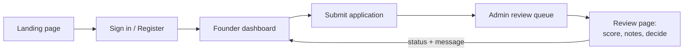
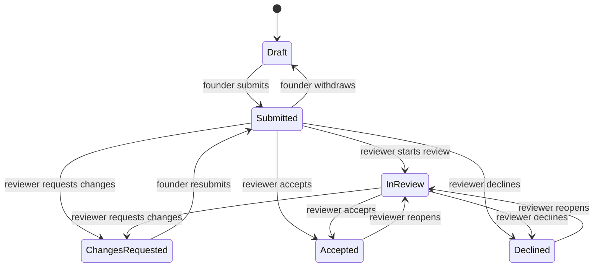

# Fundup Club — Pages & Features Reference

As of 2026-10-03. Every page in the app: what it shows, every field and its rules, and how the pieces connect.
Online copy (for sharing and comments): [claude.ai doc](https://claude.ai/code/artifact/2a03db74-a0d6-470e-8f68-c69424658a6b). **This file is the source of truth** — update it in the same commit as any change it describes.

The API behind these pages (endpoints, data model, emails, caching) is in [backend-integration.md](backend-integration.md); running it is in [deployment.md](deployment.md).

## Overview

The site has four areas: a public landing page, sign-in pages, a founder dashboard where startups submit their application, and an admin panel where the support team reviews them. The website is built with Next.js 16 (App Router), React 19 and Tailwind CSS 4, with no extra dependencies; its data lives in a Django API ([backend/](../backend/)), which also has a back office at `/backoffice/` for content, accounts and roles.

| Route | Page | Who uses it | Access |
| --- | --- | --- | --- |
| `/` | Landing page | Everyone | Public |
| `/about` | About Fundup Club | Everyone | Public |
| `/contact` | Contact form | Everyone | Public |
| `/newsletter` | The Founder Brief: newsletter sign-up and article list | Everyone | Public |
| `/newsletter/[slug]` | One newsletter article | Everyone | Public |
| `/events` | Events calendar | Everyone | Public |
| `/events/[slug]` | One event, with registration | Everyone | Public |
| `/demo-day` | Demo Day: the program roadmap and how the day works | Everyone | Public |
| `/startups` | Startup directory: every submitted application, with search and filters | Everyone | Public |
| `/startups/[slug]` | One startup's public page | Everyone | Public |
| `/privacy`, `/terms`, `/code-of-conduct` | Legal pages | Everyone | Public |
| any other path | Branded 404 page | Everyone | Public |
| `/login` | Sign in | Founders, reviewers | Public |
| `/register` | Create account | New founders | Public |
| `/forgot-password` | Reset password request | Founders | Public |
| `/reset-password` | Choose a new password (from the emailed link) | Founders | Public |
| `/verify-email` | Confirm the email address (from the emailed link, or a "check your inbox" page without it) | Founders | Public |
| `/newsletter/unsubscribe` | Leave the newsletter (from the emailed link) | Subscribers | Public |
| `/dashboard` | Founder overview | Founders | Signed in |
| `/dashboard/profile` | Your profile (step 1 of 3) | Founders | Signed in |
| `/dashboard/startup` | Startup details (step 2 of 3) | Founders | Signed in |
| `/dashboard/team` | Team (step 3 of 3) | Founders | Signed in |
| `/dashboard/review` | Review & submit | Founders | Signed in |
| `/dashboard/account` | Account settings: name and password | Founders | Signed in |
| `/admin` | Review queue | Support team | Reviewers only |
| `/admin/applications/[id]` | Review one application | Support team | Reviewers only |
| `/admin/export` | CSV download of all applications | Support team | Reviewers only |
| `/backoffice/` | Back office (Django admin): events, articles, users and roles, subscribers, messages | Staff | Back-office accounts |

```mermaid
flowchart LR
  L[Landing page] --> A[Sign in / Register]
  A --> D[Founder dashboard]
  D --> S[Submit application]
  S --> Q[Admin review queue]
  Q --> R[Review page:<br/>score, notes, decide]
  R -->|status + message| D
```

A founder fills in the application in the dashboard and submits it; a reviewer picks it up in the admin queue, scores it and decides; the decision and any message appear back on the founder's dashboard.

**Everything is live:** accounts and sessions, the applications, events, articles, subscribers and messages are all stored by the API in PostgreSQL, and the emails described on this page are sent. See [Data model and storage](#data-model-and-storage) and [backend-integration.md](backend-integration.md).

## Landing page (`/`)

The landing page kept its design on desktop; the mobile version was reworked, cutting its height at 375px from 10,365px to about 6,900px. The hero (with its header) was then rebuilt for the Fundup Club brand: a light intro holding the featured founders, over a dark Demo Day band. The desktop header also has a **Sign in** link. Every **Apply now** button (header, mobile menu, CTA bands, footer), the landing header's **Launch your startup** and the hero's **Join the club** link to `/dashboard`; signed-out visitors are sent to `/login`. **Join a free event** (CTA band), **Attend a free event** (join banner) and the footer's **Startup Events** link to `/events`.

Code: [src/app/page.tsx](../src/app/page.tsx), sections in [src/components/](../src/components/). The hero is [Hero.tsx](../src/components/Hero.tsx) with its parts in [src/components/hero/](../src/components/hero/).

| Section | Content | Mobile behaviour |
| --- | --- | --- |
| Header | Logo, 6 links (About → `/about`, Contact → `/contact`, Startups → `/startups`, Events → `/events`, Demo Day → `/demo-day`, Newsletter → `/newsletter`), Sign in, Apply Now. On this page it is the white bar from the hero design (`<Navbar variant="summit" />`: orange underline on hover, orange **Launch your startup** button); other pages keep the classic bar | Pinned to the top; frosted on scroll; hides scrolling down, returns scrolling up; compact **Apply** button once the hero is out of view |
| Mobile menu | Same 6 links, Apply Now, Sign in link | Large tap targets, fade-in, CTA at the bottom clear of the home bar |
| Hero | Light intro: "Where founders find their next", **Built to launch. Made to connect.**, sub-copy, **Explore startups** (→ `/startups`), **Join the club** (→ `/dashboard`), up to five founder photos (featured founders who uploaded one; left out when nobody has) with 25,000+ founders trained · 180+ investment firms; on the right the **Featured founders** panel. Dark **Demo Day** band: "Tomorrow's big ideas. Live on stage.", **Explore Demo Day** (→ `/demo-day`), the next Demo Day from the events API ([src/lib/events.ts](../src/lib/events.ts)) (date links to its event page; "date soon" + newsletter link when none is scheduled), and up to three numbered pitch cards: the startups most recently accepted into the cohort, from the API's directory (name, sector, one-line pitch; each → its `/startups/[slug]` page), chosen in [hero/demo-day.ts](../src/components/hero/demo-day.ts). The stage photos behind them are event imagery, not pictures of those founders | Everything stacks; full-width buttons; pitch cards become a swipe row |
| Featured founders panel | Dark card on the right of the hero's intro: title, tagline, **All startups** (→ `/startups`), and auto-scrolling rows of founder cards, pausing on hover or keyboard focus. **The cards come from the API's public directory**, chosen in [hero/founders.ts](../src/components/hero/founders.ts): up to 12 startups, the cohort before those in review or newly applied, founders with a photo first, most recent first (never ones that weren't selected). Each card shows the applicant's photo (initials until they upload one), name and role, the startup's logo and name, and a short sector label, and links to that startup's page. Two rows from six cards up, one row below that, and a line of copy instead when no startup has applied yet | With reduced motion the rows stand still and scroll sideways instead |
| Stats marquee | 5 scrolling programme stats | Unchanged |
| Six-stage journey | Discover, Build MVP, Validate, Traction, Demo Day / Fundraise, Scale. Each stage carries its week range and a one-line focus (`STAGES` in `Journey.tsx`); every card's **Learn more** opens the roadmap on `/demo-day`, the Demo Day card the page itself | Swipe row with a 01 / 06 counter instead of six stacked cards |
| Our startups (`#startups`) | "Building with us right now" with a count line (startups, industries, countries) and **Explore startups** (→ `/startups`). Filter chips with counts (All, In the cohort, In review, Applied). Every submitted startup in a numbered two-column list (cohort first, then in review, then applied; newest first within each): 8 at first, **Load more** adds 8 at a time (focus moves to the first new startup; "Showing N of M" with a progress bar is announced to screen readers), then a link to the directory, keeping the active filter (`/startups?status=…`). Each row: logo (initials on a colour until one is uploaded), number and name (→ `/startups/[slug]`), "In the cohort" / "In review" / "New" (applied this week) pill, tagline, industry · stage · country, and active users on the right. Read from the API's public directory like `/startups` (drafts never appear), refreshed with the page; an empty state shows when nothing is submitted. Code: [StartupList.tsx](../src/components/StartupList.tsx), [startup-list/Browser.tsx](../src/components/startup-list/Browser.tsx). Rows slide in batch by batch; on hover the row tints, the tile tilts with a light sweep, an orange bar grows and an arrow replaces the user count | One column; filter chips scroll sideways; country and user count hidden; Load more and Explore startups full width |
| CTA band | Apply now, Join a free event | Full-width stacked buttons |
| Alumni stories | Logo marquee, 6 testimonials, View more alumni (→ `/startups?status=cohort`) | Swipe row of equal-height cards |
| Join banner | "Stop Planning. Start Building." with Apply now and Attend a free event, beside the Fundup Club team photo (`public/images/fundup-team.png`). The photo is shown whole on the right half, in its own 4:3 shape standing on the bottom edge, so nobody at the sides is cut off; on wide screens it fills the panel's height and only the floor is cropped. Its left and top edges fade into the panel | Full-width buttons, eyebrow on two clean lines; the photo sits behind the text, darkened |
| FAQ | 5 questions (accordion), "Still have a question? Ask the team" (→ `/contact`) | Unchanged |
| Unicorn CTA | Apply now | Full-width button |
| Footer | About text, 3 link groups (Program, Discover, Company) with real destinations only, legal links, dynamic copyright year. Social icons appear only once their profile URLs are filled in (`SOCIAL` in `Footer.tsx`) | Link groups fold into tap-to-open sections |

Across the page, hover effects only apply to devices with a mouse, so tapped cards don't stay lifted. Anchor links also stop clear of the pinned header.

The hero's motion (staggered entrance, line-by-line headline reveal, pulsing label dot, founders marquee, hover lifts) is all off under the system's reduced-motion setting. The page is static: refreshed every minute, and as soon as an event or a startup's status changes, so the next Demo Day date and the startup list stay current. The footer's **Featured founders** link and the "Meet the portfolio" link on `/demo-day` point to `/#founders`. The old separate Startup Accelerator section (accelerator intro and founder carousel) was removed when the panel replaced it.

## About page (`/about`)

Code: [src/app/about/page.tsx](../src/app/about/page.tsx). Same header and footer as the landing page; the intro band is [src/components/PageHeader.tsx](../src/components/PageHeader.tsx), shared with `/contact`.

| Section | Content |
| --- | --- |
| Intro | "Where ideas meet capital" and a short description |
| Mission | Mission copy beside 6 key numbers (the landing page's placeholder figures) |
| How we work | 4 value cards: Founders first, Global by default, Structure that ships, Access to capital |
| The program | The six stages as a numbered grid, reusing `STAGES` from `Journey.tsx`; links to `/#program` |
| Closing CTA | The landing page's dark-to-orange "Turn your idea into the next unicorn" band (Apply now → `/dashboard`) |

## Contact page (`/contact`)

Code: [src/app/contact/page.tsx](../src/app/contact/page.tsx), form in [src/components/contact/ContactForm.tsx](../src/components/contact/ContactForm.tsx), server action in [src/app/contact/actions.ts](../src/app/contact/actions.ts).

| Field | Form name | Type | Rule |
| --- | --- | --- | --- |
| Full name | `name` | text | Required; 2–80 characters, one line |
| Email | `email` | email | Required; valid format (no spaces or `, ; : < > ( ) " [ ] \`); max 254 |
| Company | `company` | text | Optional; max 120 characters, one line |
| What's this about? | `topic` | select | Required; one of: Applying to the program, Investing or partnerships, Mentoring, Press, Something else (also in `GET /api/v1/options` as `contactTopics`) |
| Message | `message` | textarea | Required; 10–2000 characters |

- A hidden `website` field catches bots: if it's filled in, the form shows success but saves nothing.
- On success the form is replaced by **Message sent** (with the sender's email) and a **Send another message** button. A refused message keeps what was typed, including the chosen topic.
- **Focus and announcements (contact, event registration and unsubscribe forms):** the submit button stays focusable while sending (`aria-disabled`), and the answer moves focus: to the success heading, else to the first field with an error, else to the error message, which sits in an alert region that's always on the page so screen readers announce it ([useResponseFocus.ts](../src/components/auth/useResponseFocus.ts), `FormAlert`). Inputs have `maxLength` matching the limits, so an enormous paste can't make the page fail. Length errors read "Keep this to N characters or fewer."
- Messages are stored by the API ([src/lib/contact.ts](../src/lib/contact.ts) → `POST /api/v1/contact`) and emailed to the support team (`SUPPORT_EMAILS`, or every reviewer) with the sender as reply-to. They're also listed in the back office, where they can be marked handled. Limited to 10 per hour per address.
- Beside the form: shortcut cards to apply (`/dashboard`), the FAQ (`/#faq`) and sign in (`/login`).

## Newsletter (`/newsletter`)

"The Founder Brief". Code: [src/app/newsletter/page.tsx](../src/app/newsletter/page.tsx), pieces in [src/components/newsletter/](../src/components/newsletter/).

| Section | Content |
| --- | --- |
| Hero | Headline, sign-up form, three promises (every other Thursday, 5-minute read, free), and a mock inbox card previewing the latest issue |
| Featured | The newest article as a large card |
| Latest issues | Topic chips (All, Fundraising, Building, AI, Founder Stories, Program News) over a 3-column grid. "All" leaves out the featured article; a topic shows every article in it |
| Sign-up band | Dark band with a second sign-up form |

- **Articles come from the API** ([src/lib/newsletter.ts](../src/lib/newsletter.ts)) and are written in the back office (Posts): title, issue number, topic, author, date, excerpt and the text, in a simple format (blank lines between paragraphs, `## ` or `### ` headings, `- ` lists, `1. ` numbered lists, `> ` quotes with a last `> — Name` line for the credit; a list or quote can follow a heading or sentence on the very next line). Text is always shown as text: HTML in it is never run. Read time is estimated if left at 0 or empty. An issue dated in the future stays hidden (from the list, its page and the sitemap) until that day (UTC). The launch set (the site's original placeholder issues) is loaded by `seed_content`, once per database; replace it with real issues before launch (deleting the placeholders is safe: they don't come back on the next restart). With no published issue, the page shows just the sign-up and an empty archive.
- The page is static and refreshed every minute, or as soon as an issue is saved in the back office.
- **Covers are drawn in SVG** ([Cover.tsx](../src/components/newsletter/Cover.tsx)): one motif and colour scheme per topic plus the issue number, so the pages load no images.
- Only the topic filter and the sign-up forms run JavaScript; the cards are server-rendered. The filter is the shared [src/components/ui/FilterList.tsx](../src/components/ui/FilterList.tsx), also used by `/events`.

### Article page (`/newsletter/[slug]`)

Code: [src/app/newsletter/[slug]/page.tsx](<../src/app/newsletter/[slug]/page.tsx>). Articles are rendered on their first visit and then cached like the other public pages; unknown slugs return 404.

- Header: back link, topic, issue number, date, read time, title, summary, author.
- Large cover, then the article (paragraphs, headings, lists, pull quotes) at a comfortable reading width.
- A thin orange reading-progress bar at the top, driven by CSS alone (browsers without scroll-driven animations simply don't show it).
- Sign-up card after the article, then "More from the Brief": up to 3 articles, same topic first.

### Sign-up form

| Field | Form name | Rule |
| --- | --- | --- |
| Email | `email` | Required; valid format |

- Server action: [src/app/newsletter/actions.ts](../src/app/newsletter/actions.ts). Each form also sends a hidden `source` (`newsletter-hero`, `newsletter-band`, `article:<slug>`), saved with the address.
- Success: **"You're in. The next issue goes to …"**. An address already on the list (any capitalisation) gets **"… is already on the list."**
- Same hidden `website` bot trap as the contact form.
- A refusal from the API (an address it won't take, or too many sign-ups from one address) shows the API's own message under the field.
- Subscribers are stored by the API (`POST /api/v1/newsletter/subscribers`, 20 per hour per address). A new subscriber gets a welcome email with an unsubscribe link; someone who unsubscribed and signs up again is welcomed back. Subscribers can be exported as CSV from the back office.

### Unsubscribe (`/newsletter/unsubscribe?token=…`)

The link in every newsletter email. The page explains what stops and asks the subscriber to press **Unsubscribe** (a button rather than the link itself, so mail scanners that open every link can't unsubscribe anyone). The token names the subscriber by id, never by address. Opened with no token (or an empty or doubled one), the page says the link is incomplete and links to `/newsletter` instead of showing a button. Success shows **You're unsubscribed**. Hidden from search engines.

## Events (`/events`)

Code: [src/app/events/page.tsx](../src/app/events/page.tsx), pieces in [src/components/events/](../src/components/events/).

| Section | Content |
| --- | --- |
| Hero | "Meet the network in person", Browse events button, three facts (free, online and in person, number of cities this season) and a dark **Featured** card: the next Demo Day (or the next event if none), with a live countdown |
| Upcoming events | Type chips (All, Demo Day, Workshop, Office Hours, Networking, Info Session) over a list of ticket-style cards: date stub, type, place (Online or city), time in the event's own time zone, summary, Register |
| Recently | The 3 most recent past events, marked Ended |
| Sign-up band | Newsletter sign-up (`source: events`), linking to `/newsletter` |

- **Events come from the API** ([src/lib/events.ts](../src/lib/events.ts)) and are managed in the back office (Events): title, type, format, city, start and end (entered and shown in the event's own time zone), time zone (chosen from a list of region/city zones, plus UTC), capacity (at least 1), summary, about (paragraphs), what you'll get (one per line), the agenda, who it's for, and the private venue or joining link, which is only ever emailed to registered guests. Unpublished events are hidden. The launch set (the site's original placeholder events) is loaded by `seed_content`; replace it with the real calendar before launch.
- An event moves from Upcoming to Recently once its end time passes. The pages are static, refreshed every minute and as soon as an event is saved in the back office.
- Times are shown in each event's own time zone (e.g. `4:00 PM – 8:00 PM PDT`), with both dates when an event runs over more than one day.
- The countdown shows dashes until the page loads in the browser, then ticks every second. It is hidden from screen readers because the date is always shown as text.

### Event page (`/events/[slug]`)

Code: [src/app/events/[slug]/page.tsx](<../src/app/events/[slug]/page.tsx>). Unknown slugs return 404.

- Header: back link, type, place, title, summary (and an **Ended** badge for past events).
- Three fact cards (date and time, place, capacity), About, What you'll get, an Agenda timeline and Who it's for.
- Registration card beside the details (above them on phones), sticky on desktop: date, countdown and the form. Past events show **This event has ended** and a link to upcoming events instead.
- "More events": up to 3 other upcoming events.

| Field | Form name | Rule |
| --- | --- | --- |
| Full name | `name` | Required; 2–80 characters |
| Email | `email` | Required; valid format |
| Company | `company` | Optional; max 120 characters |

- Server action: [src/app/events/actions.ts](../src/app/events/actions.ts). The API rejects unknown events, events that have ended and full events (capacity), whatever the page shows.
- Success: **You're registered** (or **You're already registered** if that email, in any capitalisation, already signed up for this event), plus an **Add to Google Calendar** link with the event's times.
- If the event has ended or is full by the time the form is sent, the form is replaced by **Registration is closed**, the reason, and a link to upcoming events.
- Sections with nothing in them (what you'll get, agenda, who it's for) are left out. An event whose time zone the browser doesn't know is shown in UTC rather than failing.
- Same hidden `website` bot trap as the other forms.
- Registrations are stored by the API (one per email per event; 30 per hour per address) and listed, with a CSV export, in the back office. The guest gets a confirmation email with the venue or joining link and a calendar invite (`invite.ics`), and, if they registered more than a day ahead, a reminder the day before.

## Demo Day (`/demo-day`)

Code: [src/app/demo-day/page.tsx](../src/app/demo-day/page.tsx); the roadmap is [src/components/demo-day/Roadmap.tsx](../src/components/demo-day/Roadmap.tsx). The header uses its dark variant here (`<Navbar tone="dark" />`): white text over the dark hero, back to ink once the pinned mobile bar frosts or the menu opens.

| Section | Content |
| --- | --- |
| Hero | Dark, over the landing photo: "Stage 05 of 06 · Weeks 9–10", **Demo Day**, Reserve a seat (next Demo Day event) and See the roadmap; a card for the next Demo Day with a live countdown; four format facts (20 startups, 5-minute pitches, 180+ firms, 1:1 meetings) |
| The program roadmap | The six stages as a winding road (desktop) or a vertical timeline (phones). Each card shows the week range, title and focus; Demo Day is the highlighted milestone with a pulsing marker; the road after it is dashed ("after the program") |
| What it is | Copy, the "what every founder walks in with" checklist, and a team photo (stock, Unsplash License; swap for a real Demo Day photo) with a 180+ firms badge |
| Before, on the day, after | Three cards: the two-week run-up, the day's agenda (taken from the next Demo Day event, with a fallback), and what happens after |
| Five minutes, five beats | The pitch structure as a proportional bar: Problem 60s, Product 60s, Traction 90s, Team 30s, The ask 60s |
| The room | Six network figures on a dark band (the landing page's placeholder numbers) |
| From Demo Day to funded | Three alumni testimonials and the five featured founders with headshots |
| Two ways in | Come and watch (→ next Demo Day event) and Pitch at the next one (→ `/dashboard`) |
| Questions | Five-question accordion, with a link to `/contact` |

- "Next Demo Day" is the soonest upcoming event of type Demo Day from the events API ([src/lib/events.ts](../src/lib/events.ts)). With none scheduled, the hero card and the "come and watch" card say a date is coming and point to the newsletter and events pages. The page is static, refreshed every minute and as soon as an event changes.
- The run-up, walk-in checklist, pitch timings and FAQ answers describe the intended format and are **placeholders to confirm** before launch, like the rest of the site's copy.
- Demo Day event pages link here ("How Demo Day works").

## Startup directory (`/startups`)

Code: [src/app/startups/page.tsx](../src/app/startups/page.tsx), filters in [src/components/startups/Directory.tsx](../src/components/startups/Directory.tsx), cards in [src/components/startups/StartupCard.tsx](../src/components/startups/StartupCard.tsx). Built from the API's public directory (`GET /api/v1/startups`): **every application that has been submitted appears; drafts never do, and neither do startups of accounts deactivated in the back office.** Each shows its answers as last submitted: while a founder is making requested changes, the public page keeps the submitted version until they resubmit (the status, logo and photo are always current). "Applied" is the date of the first submission, so a resubmission doesn't count as new. A submission, withdrawal or decision made on the website shows up on the next page anyone opens; a change made elsewhere (the back office) within seconds: the next visitor may still get the previous copy while a fresh one renders, and if the API is unreachable at that moment the previous copy keeps being served rather than an error.

| Section | Content |
| --- | --- |
| Intro | "The startups building with us" and four live counts: startups, in the cohort, industries, countries |
| Filters | Search (name, one-liner, industry, country, stage, founder names), then Status, Industry and Stage lists with counts. A sidebar on desktop; horizontal chip rows on phones. Counts update as the other filters change |
| Results | Result count, sort (Newest first, Cohort first, Name A–Z) and the card grid |
| Card | The startup's logo (until it uploads one: its initials on a colour derived from the name), name, public status, industry, one-liner, stage · country · founded, users and paying customers when given, founders' names with the applicant's photo (initials for the others), applied date |

- Filters are instant (no page reload) and mirrored into the URL (`?q=&status=&industry=&stage=&sort=`), so a filtered view can be shared; the page also opens straight into a shared query.
- **Public status** maps the review status: Accepted → **In the cohort**; In review and Changes requested → **In review**; Submitted → **Applied**; Not selected → **Not selected**. Defined in [src/lib/application/directory.ts](../src/lib/application/directory.ts).
- Empty state when nothing matches, with a button that clears the filters; a different one when the store has no submitted applications yet.

### Startup page (`/startups/[slug]`)

Code: [src/app/startups/[slug]/page.tsx](<../src/app/startups/[slug]/page.tsx>). The slug is the startup's name (`greenloop`), fixed when it's first submitted; a second startup with the same name gets `-2`. It only changes if the startup is renamed and resubmitted, so shared links keep working. Unknown slugs return 404.

- Header: back link, logo (or initials), name, public status, one-liner, industry / stage / country chips, and links to the website, product demo and video when given.
- Main column: active users and paying customers (when given), The problem, The solution, Who it's for, Market, Competition and edge, Headline metric, The team (why this team, worked together, hiring) and About the founder (photo, title, location, years of experience, bio, LinkedIn). Sections with no content are left out.
- Sidebar (sticky on desktop): facts (stage, industry, HQ, founded, business model, incorporated, team size, applied), founders and team (name, role, commitment, Founder badge, LinkedIn), and a Journey timeline.
- "More startups": three others, same industry first.

Long words and links wrap instead of widening the page, text in right-to-left scripts keeps its order (`dir="auto"`), multi-line answers keep their line breaks, initials skip emoji, and filters in a shared link (`?status=`, `?industry=`, `?stage=`, `?sort=`) are matched without regard to capitals, unknown values being dropped. Countries are counted without regard to capitals or spaces.

### What is public, and what is not

The public view is an allowlist in the API, `public_card` and `public_startup` in [backend/apps/applications/payloads.py](../backend/apps/applications/payloads.py) (the website just shows it: [src/lib/application/public.ts](../src/lib/application/public.ts)). **Shown:** startup name, one-liner, website, demo and video links, industry, stage, HQ, founded, incorporated, business model, problem, solution, target customer, market, competitors, advantage, headline metric, active users, paying customers, team names, roles, commitment and LinkedIn, why-us, worked-together, hiring needs, the applicant's name, title, location, bio, experience and LinkedIn, and the dated milestones (titles only). **Never shown:** emails, phones, equity, monthly revenue, growth rate, raised, seeking, use of funds, the deck link, how they heard of us, review messages, and all reviewer data. Widen or narrow it there, nowhere else.

**Before launch, decide:** whether applicants must opt in to a public listing (the application form has no such consent today), and whether declined applications should be listed at all.

## Legal pages, errors and search engines

- **`/privacy`, `/terms`, `/code-of-conduct`** share one frame ([src/components/LegalArticle.tsx](../src/components/LegalArticle.tsx)): intro, numbered sections, a "last updated" date and a sidebar linking the three. The texts are **drafts written to match what the site actually does** (what is collected, the public startup directory, events, the newsletter). Have counsel review them and add the legal entity, address, governing law and a named reporting contact before launch. Linked from the footer and from the register form's consent line.
- **404** ([src/app/not-found.tsx](../src/app/not-found.tsx)): branded page with the site header and footer and links to the startups, events, newsletter and contact pages. Unknown startup, event and newsletter slugs land here too.
- **Errors** ([src/app/error.tsx](../src/app/error.tsx), [src/app/global-error.tsx](../src/app/global-error.tsx)): a "Something went wrong" page with a Try again button and the error reference. Deliberately free of the header and footer so it can't fail the same way the page did.
- **`/robots.txt`** allows everything except `/dashboard`, `/admin` and the sign-in pages, and points at **`/sitemap.xml`**, which lists every public page, article, event and startup. Both use `NEXT_PUBLIC_SITE_URL` ([src/lib/site.ts](../src/lib/site.ts)), which also sets the canonical base for link previews.
- A **Skip to content** link is the first focusable element on every page (visible when focused); every page's `<main>` has `id="main"`.

## Authentication pages

Accounts and sessions live in the API; [src/lib/auth.ts](../src/lib/auth.ts) is the website's side (it copies the API's `vcs_session` cookie onto the browser and forwards it on every signed-in call). The pages share one layout ([src/app/(auth)/layout.tsx](<../src/app/(auth)/layout.tsx>)): a dark brand panel on the left (desktop only) and the form on the right. All of them are hidden from search engines (`noindex`). Server actions: [src/app/(auth)/actions.ts](<../src/app/(auth)/actions.ts>).

### Sign in — `/login`

| Field | Form name | Type | Rule |
| --- | --- | --- | --- |
| Email | `email` | email | Required; must look like an email address |
| Password | `password` | password (show/hide toggle) | Required |
| Keep me signed in | `remember` | checkbox | Optional: ticked, the session lasts 30 days; otherwise it ends when the browser closes (and after 24 hours at most) |

- **Continue with Google** button above an "or with email" divider.
- **Forgot password?** carries any email already typed into `/forgot-password?email=…`.
- On success founders go to `/dashboard` (`AFTER_SIGN_IN`) and reviewers to `/admin`, unless the page was opened as `/login?next=…`: then they go back there. Signed-out visitors to any `/dashboard` or `/admin` page (a link in an email, say) are sent to `/login?next=<that page>` ([src/proxy.ts](../src/proxy.ts)). `next` is only followed to a path on this site inside the visitor's own area (a founder to `/dashboard…`, a reviewer to `/admin…`); anything else, another site included, falls back to their home ([src/lib/session.ts](../src/lib/session.ts)). Google sign-in carries it through too.
- A wrong email or password gets one message for both, so the form never reveals who has an account. Sign-in is limited to 10 attempts a minute per address, and 5 failed attempts per account per address per 15 minutes (50 per account per hour from anywhere); only failures count, so nobody can lock a founder out by trying their address. Past a limit the banner says how long to wait.
- `?error=google…` (after a failed Google sign-in) shows why in the banner: cancelled, expired, a Google account without a verified address, a deactivated account, too many attempts, Google sign-in unavailable, or a generic failure.
- A refused sign-in keeps the email and the **Keep me signed in** tick (React resets a form after its action, so the action sends both back).

### Create account — `/register`

| Field | Form name | Type | Rule |
| --- | --- | --- | --- |
| Full name | `name` | text | Required; 2–80 characters |
| Email | `email` | email | Required; valid format; max 254 characters |
| Password | `password` | password (show/hide toggle) | Required; 8–200 characters; at least one letter and one number; not a common password (checked by the API) |
| Terms of Use and Privacy Policy | `terms` | checkbox | Must be ticked; stays ticked after a refused submit |

- **Sign up with Google** button above the form.
- On success it redirects to `/dashboard`, signed in, and the API emails a link to confirm the address (see `/verify-email`). An address that's already registered gets *"That email is already registered."* under the email field.

### Reset password — `/forgot-password`

| Field | Form name | Type | Rule |
| --- | --- | --- | --- |
| Email | `email` | email | Required; valid format; prefilled from `?email=` |

- After sending, the page switches to **Check your inbox**, with a **Use a different email** button back to the form.
- The confirmation says *"If an account exists for …"*, so the page never reveals which addresses are registered: the API answers the same way either way and sends the email (if any) in the background. The link works once, for 30 minutes.

### Choose a new password — `/reset-password?token=…`

Where the emailed link lands. One field, **New password** (`password`, same rules as sign-up). Success signs the user in, ends their other sessions, emails a "your password was changed" notice and goes to `/dashboard`. A used or expired link shows a banner with a link back to `/forgot-password`. Code: [ResetPasswordForm.tsx](../src/components/auth/ResetPasswordForm.tsx), action `chooseNewPassword`.

### Confirm your email — `/verify-email?token=…`

Where the sign-up email's link lands. Opened without the link, it says to check the inbox, with a **Resend link** button for a signed-in visitor (reviewers who haven't confirmed yet are sent here; a confirmed visitor goes straight on to their home). The visitor presses **Confirm my email** (a button rather than the link itself, so mail scanners that open every link can't use the token up first), then sees **Email confirmed** and a link to the dashboard. The link works for 3 days; the dashboard's notice can send a new one. A reviewer's access to `/admin` starts only once their address is confirmed. Code: [VerifyEmailForm.tsx](../src/components/auth/VerifyEmailForm.tsx), action `confirmEmail`.

### Shared behaviour

- Validation runs on the website's server ([src/lib/validation.ts](../src/lib/validation.ts)) and again in the API, in the same words; each error shows under its field and is linked to it for screen readers.
- Typed values survive a failed submit (never the password).
- Inputs are 52px tall with 16px text, which stops iPhones zooming in on focus.
- **Google sign-in** (needs `GOOGLE_CLIENT_ID` on the website and the client id and secret on the API): the button stores a random `state` in a 10-minute cookie and sends the visitor to Google; Google returns them to `/api/auth/callback/google` ([route.ts](../src/app/api/auth/callback/google/route.ts)), which checks the `state`, and the API exchanges the code for the verified Google identity, creating the account or joining an existing one with the same address. Cancelled, expired or failed attempts return to `/login` with a message saying why.
- If the API can't be reached, the forms say so (*"We couldn't reach the server just now…"*) instead of failing.

## Founder dashboard: layout and navigation

Every `/dashboard` page shares one frame ([src/app/dashboard/layout.tsx](../src/app/dashboard/layout.tsx)) showing the application's status and completion. Signed-out visitors (or an expired session) are sent to `/login?next=<the page>`, and come back to it once signed in; the application is created by the API on the first visit. Reviewers never get one: their `/dashboard` visits go to `/admin` (or, until they confirm their address, to `/verify-email`), so no founder draft is started in a staff member's name. Until the founder confirms their email, a notice at the top of every page says where the link went, with a **Resend link** button.

**Desktop (1024px and up): left sidebar**

- Fundup Club logo, linking to the landing page.
- Application card: status badge, percent complete and a progress bar.
- Navigation: Overview, Profile, Startup, Team, Review & submit. Each section shows a green tick when complete, otherwise a count such as `3/6`.
- "Questions?" card linking to the FAQ.
- User block: initials, name and email (linking to **Account settings**) and a sign-out button.

**Phones and tablets: sticky header**

- Logo, status badge, and an account menu (name, email, Account settings, Sign out).
- A swipeable row of section tabs with the same ticks and counts.

**Shared behaviour**

- **Saving:** each section form has a save bar that sticks to the bottom of the screen. It shows *Unsaved changes*, *Saving…*, *Changes saved.* or the error, and the browser warns before closing the tab with unsaved edits. A save the server refuses keeps everything typed or picked, dropdowns and choice cards included, so only the flagged field needs fixing.
- **Required fields** are marked `*`. They are only needed to submit; drafts can be saved with gaps.
- **Locked sections:** while the application is with the review team, every section page shows a lock notice and read-only fields.
- **Feedback banner:** when changes are requested, the review team's message appears at the top of every page.
- **Loading:** a skeleton shows while a page loads. A page that fails to load (the API unreachable) shows *This page didn't load* with **Try again**, inside the dashboard's frame ([src/app/dashboard/error.tsx](../src/app/dashboard/error.tsx)).
- **Session ended mid-edit:** a save after the session ended (signed out elsewhere, or expired) isn't redirected away: the form keeps what was typed and says *"You've been signed out, so this wasn't saved."* with **Sign in again (new tab)** (to `/login?next=<this page>`); sign in there, come back and save.
- **Refused because something changed:** when a save, a submission or a withdrawal is refused because the application changed elsewhere (locked for review, a member removed in another tab, an answer cleared), the page refreshes to show what's true now (the lock, the list of missing answers).
- **Line breaks** count as one character everywhere (browsers send them as two), so a long answer the counter accepts is accepted by the API too.
- **Sign out** shows *Signing out…* while it runs.
- **Titles and search engines:** pages are titled "… — Fundup Club" and hidden from search engines.

Server actions for all dashboard pages: [src/app/dashboard/actions.ts](../src/app/dashboard/actions.ts). Each sends what was typed to the API (`/api/v1/me/application/…`), which checks every rule against the stored application and answers with the same field names and messages shown below.

## Overview page (`/dashboard`)

The overview answers two questions for a founder: where the application stands, and what to do next. It greets them by first name ("Welcome back, Alex").

| Panel | What it shows |
| --- | --- |
| Feedback banner | Only when changes are requested: the latest message from the review team, shortened, with a link to read it in full and resubmit |
| Status card | Completion ring (0–100%), status badge, a headline (e.g. "12 answers left before you can submit", "In the review queue"), a short explanation, and one button for the next step |
| Your checklist | Profile, Startup details, Team: each with answered/total, a progress bar and a link to that section |
| Snapshot | Startup name, industry, stage, team size (people · founders), monthly revenue, amount being raised |
| Your stage | The six programme stages, with earlier stages ticked and the current one marked "You are here"; **Change** / **Set stage** links to the stage question |
| What happens next | 4 steps (complete the application, validation & analysis, founder interview, decision), marked done, *Now* or upcoming by status |
| Activity | Timeline of events, newest first; review-team entries are labelled and show their message |

**The status card's button changes with the situation:**

- While editing, with sections incomplete: *Continue: \<next unfinished section\>*.
- While editing, everything answered: *Review & submit*.
- After submitting: *View your application*.

## Profile page (`/dashboard/profile`) — step 1 of 3

The profile has 11 fields; 6 must be answered before the application can be submitted. Fields are grouped into four cards: About you, Where you're based, Commitment, Your story. Saved by `saveProfile`.

Above the form is **Your photo** (optional): see *Logo and founder photo* below.

| Field | Form name | Input | Needed to submit | Rules when saving |
| --- | --- | --- | --- | --- |
| Full name | `fullName` | text | Yes | Max 80 characters; filled from the account |
| Your role | `title` | text (e.g. "CEO & co-founder") | Yes | Max 80 characters |
| Email | — | read-only | — | Comes from the account; never read from the form |
| Phone | `phone` | tel | No | 7–15 digits, with country code |
| LinkedIn | `linkedin` | url | Yes | Must be a link to linkedin.com (or a subdomain such as uk.linkedin.com), not merely mention it; `https://` added if missing |
| Years of work experience | `experienceYears` | number | No | Number 0–60 |
| Country | `country` | text | Yes | Max 60 characters |
| City | `city` | text | No | Max 60 characters |
| Commitment | `commitment` | choice: `full-time` / `part-time` | Yes | One of the two options |
| How did you hear about us? | `heardFrom` | dropdown | No | Friend or alumni referral, Fundup Club event, Social media, Search, Press or podcast, Other. Answers saved as "VC Summit event" (the old brand name) are read back as "Fundup Club event" (by the API, `profile_data` in [backend/apps/applications/models.py](../backend/apps/applications/models.py)) |
| Short bio | `bio` | long text, live counter | Yes, at least 60 characters | Max 1,200 characters |

The *Next: startup details* link sits under the form.

## Startup page (`/dashboard/startup`) — step 2 of 3

This is what the review team validates and analyses: 26 fields in six parts, 12 of them needed to submit. Jump links at the top (Basics, Stage, The idea, Traction, Funding, Materials) scroll to each part. Saved by `saveStartup`.

Above the form is the startup's **Logo** (optional).

### Logo and founder photo

Code: [ImageUpload.tsx](../src/components/dashboard/ImageUpload.tsx), `uploadImage` / `removeImage` in [actions.ts](../src/app/dashboard/actions.ts); the API side is [images.py](../backend/apps/applications/images.py).

- A card with the current image (initials until there is one), **Upload** / **Change** and **Remove**. Picking a file uploads it straight away: it isn't part of the section's form, so it doesn't wait for Save.
- **PNG, JPEG or WebP, up to 5 MB.** Anything else is refused in words ("Use a PNG, JPEG or WebP image.", "Keep the image under 5 MB."). The API re-encodes every upload as WebP of at most 512 × 512: photos are cropped square from the centre, logos are kept whole. The file as it was sent is never stored.
- Both are optional and don't count towards progress. Like every answer they can only change while the application is a Draft or has Changes requested.
- Both are **public** once the application is submitted: the logo on the directory, the landing page and the startup's page; the photo beside the founder's name there and in the hero's featured founders.
- The back office (Applications) can replace either one; uploads there go through the same checks.

| Part | Field | Form name | Input | Needed to submit | Rules when saving |
| --- | --- | --- | --- | --- | --- |
| Basics | Startup name | `name` | text | Yes | Max 60 characters |
| Basics | Website | `website` | url | No | Valid link; `https://` added if missing |
| Basics | One-line pitch | `tagline` | text | Yes | Max 120 characters |
| Basics | Industry | `industry` | dropdown | Yes | One of 12 options (below) |
| Basics | Business model | `businessModel` | dropdown | Yes | One of 8 options (below) |
| Basics | Headquarters (country) | `country` | text | Yes | Max 60 characters |
| Basics | Founded | `foundedOn` | month picker (`YYYY-MM`) | No | Can't be in the future (the current month counts from when it has begun anywhere, so time zones ahead of UTC can pick it) |
| Basics | Incorporated? | `incorporated` | choice: `yes` / `no` | No | — |
| Stage | Current stage | `stage` | 6 choice cards | Yes | One of the six stage ids (below) |
| The idea | Problem | `problem` | long text | Yes, at least 80 characters | Max 1,500 characters |
| The idea | Solution | `solution` | long text | Yes, at least 80 characters | Max 1,500 characters |
| The idea | Target customer | `targetCustomer` | long text | Yes | Max 600 characters |
| The idea | Market size | `marketSize` | long text | No | Max 600 characters |
| The idea | Competitors | `competitors` | long text | Yes | Max 1,000 characters |
| The idea | Unfair advantage | `advantage` | long text | Yes, at least 40 characters | Max 1,000 characters |
| Traction | Active users | `activeUsers` | number | No | Positive whole number; commas allowed (so "1.200" is refused rather than read as 1.2) |
| Traction | Paying customers | `payingCustomers` | number | No | Positive whole number |
| Traction | Monthly revenue (USD) | `monthlyRevenue` | number, `$` | No | Positive number |
| Traction | Monthly growth | `growthRate` | number, `%` | No | 0–1,000 |
| Traction | Most important metric | `keyMetric` | text | No | Max 200 characters |
| Funding | Raised to date (USD) | `raisedToDate` | number, `$` | No | Positive number |
| Funding | Currently raising (USD) | `seeking` | number, `$` | No | Positive number |
| Funding | Use of funds | `useOfFunds` | long text | No | Max 1,000 characters |

Every number on the page (and experience and equity elsewhere) is capped at 1,000,000,000,000 (*"That number is too large."*): bigger values would come back from the browser in exponent form (`1e+21`) and fail every later save.
| Materials | Pitch deck | `deckUrl` | url | Yes | Valid link |
| Materials | Product or demo | `demoUrl` | url | No | Valid link |
| Materials | Founder video (1–2 min) | `videoUrl` | url | No | Valid link |

**Stages** (they mirror the six stages on the landing page):

| # | Id | Label | Meaning |
| --- | --- | --- | --- |
| 1 | `idea` | Discover | Exploring a problem, no product yet |
| 2 | `mvp` | Build MVP | Building the first version |
| 3 | `validation` | Validate | Real users are testing it |
| 4 | `traction` | Traction | Paying customers, growing usage |
| 5 | `fundraising` | Fundraise | Raising a round now |
| 6 | `scaling` | Scale | Hiring and expanding markets |

**Industries:** AI & machine learning, B2B software / SaaS, Climate & energy, Consumer, Deep tech & hardware, E-commerce & retail, Education, Fintech, Health & biotech, Marketplaces, Mobility & logistics, Other.

**Business models:** Subscription (B2B), Subscription (B2C), Marketplace / take rate, Transactional / usage-based, Hardware sales, Advertising, Licensing, Not decided yet.

All option lists live in [src/lib/application/types.ts](../src/lib/application/types.ts); the stored value is the label text shown above (the id for stages and commitment).

## Team page (`/dashboard/team`) — step 3 of 3

The team page has two parts: the list of people, and three questions about the team. To submit it needs at least one founder, how long the founders have worked together, and a "why this team" answer of 60+ characters.

### Team members

The applicant is added automatically as the first founder. Members appear as cards (initials, name, Founder badge, role, equity, commitment, email, LinkedIn) with **Edit** and **Remove**; each opens in place. Saved by `saveMember(memberId | null)`, removed by `removeMember(memberId)`.

| Member field | Form name | Input | Rule |
| --- | --- | --- | --- |
| Name | `name` | text | Required; max 80 characters |
| Role | `role` | text (e.g. "CTO & co-founder") | Required; max 80 characters |
| Email | `email` | email | Optional; valid format |
| LinkedIn | `linkedin` | url | Optional; must be a link to linkedin.com |
| Equity | `equity` | number, `%` | Optional; 0–100 |
| Commitment | `commitment` | choice: `full-time` / `part-time` | Optional |
| This person is a co-founder | `isFounder` | checkbox | — |

- **Equity limit:** total equity across the team can't exceed 100%. The check runs in the API inside the save, so two quick saves can't together push past 100%; the total is rounded to 6 decimals, so 33.3 + 33.3 + 33.4 counts as 100, and the message names the total to the same precision (*"That brings team equity to 100.004%…"*). An **Equity allocated** meter shows the running total, rounded to 2 decimals.
- **Removing:** asks for confirmation. The last remaining member can't be removed (the API refuses too). A team lists up to 20 people.

### About the team

Saved by `saveTeamDetails`.

| Question | Form name | Input | Needed to submit | Rules when saving |
| --- | --- | --- | --- | --- |
| How long have the founders worked together? | `workedTogether` | dropdown: Less than 6 months, 6–12 months, 1–3 years, More than 3 years, Solo founder | Yes | One of the options |
| Why is this the right team for this problem? | `whyUs` | long text | Yes, at least 60 characters | Max 1,200 characters |
| Who do you need to hire next? | `hiringNeeds` | long text | No | Max 800 characters |

## Review & submit page (`/dashboard/review`)

This page shows the founder exactly what the review team will see, and it is the only place to submit. It changes depending on whether the application can still be edited.

**While editing (Draft, or Changes requested)**

- **Missing answers:** listed by section. Each links straight to the question (`/dashboard/<section>#field-<name>`), which scrolls into view, is focused and flashes orange. Short answers show how much more is needed, e.g. "39 more characters needed". When nothing is missing, a green "Everything required is answered" banner shows instead.
- **Full read-only summary** of the profile, startup (including a traction and funding grid) and team, each with an **Edit** link.
- **Submit panel:** a confirmation checkbox (`confirm`: "I confirm these details are accurate, and that I'm authorised to apply on behalf of the team"), then **Submit application**, or **Resubmit application** after changes were requested. The button stays disabled until every required answer is in. Action: `submitApplication`.
- **Activity** timeline on the right.

**After submitting**

- The title becomes *Your application*, with the status and the date submitted.
- **Withdraw to make changes:** only while the status is Submitted, i.e. before a reviewer starts. It asks for confirmation, then returns the application to Draft. Action: `withdrawApplication`.
- The summary and activity timeline stay visible, read-only.

**The server checks everything again:** submitting is refused if any required answer is missing, even when the button is bypassed, and withdrawing is refused once review has started (or, with its own message, if the application isn't submitted at all). A refused submission refreshes the page, so the list of missing answers is up to date.

**Emails:** submitting (or resubmitting) emails the founder a confirmation and each reviewer a link to the application.

## Application lifecycle

An application moves through six statuses. Founders can edit only in Draft and Changes requested; everything else belongs to the review team.

```mermaid
stateDiagram-v2
  [*] --> Draft
  Draft --> Submitted: founder submits
  Submitted --> Draft: founder withdraws
  Submitted --> InReview: reviewer starts review
  Submitted --> ChangesRequested: reviewer requests changes
  InReview --> ChangesRequested: reviewer requests changes
  ChangesRequested --> Submitted: founder resubmits
  Submitted --> Accepted: reviewer accepts
  InReview --> Accepted: reviewer accepts
  Submitted --> Declined: reviewer declines
  InReview --> Declined: reviewer declines
  Accepted --> InReview: reviewer reopens
  Declined --> InReview: reviewer reopens
```

Reviewers can decide straight from Submitted; starting a review first is optional.

| Status id | Badge | Founder can edit | Founder sees |
| --- | --- | --- | --- |
| `draft` | Draft (grey) | Yes | "Finish each section, then submit your application for review." |
| `submitted` | Submitted (orange) | No (can withdraw) | "In the review queue" — review usually starts within 5 working days |
| `in_review` | In review (orange) | No | "Our team is reviewing your startup" |
| `changes_requested` | Changes requested (yellow) | Yes | The reviewer's message on every page, and a Resubmit button |
| `accepted` | Accepted (green) | No | "You're in the cohort" — watch your inbox for onboarding |
| `declined` | Not selected (grey) | No | "Not this cohort" — welcome to apply next cycle |

**Completion:** progress is the share of the 21 required answers that are filled: 6 in the profile, 12 in the startup and 3 for the team. Free-text answers only count once they reach their minimum length (problem 80, solution 80, advantage 40, bio 60, why this team 60 characters). The same rules gate submission in the API. Rules: [src/lib/application/progress.ts](../src/lib/application/progress.ts) (what the dashboard shows) and `REQUIRED` in [backend/apps/applications/rules.py](../backend/apps/applications/rules.py) (what's enforced); change both together.

## Admin: review queue (`/admin`)

The queue is the support team's work list, opening on **Needs review** with the longest-waiting application first. Every admin page has a dark header with the logo, a *Review* label, links to Queue and Export CSV, and the reviewer's name, initials and sign-out.

- **Summary line:** "N waiting for review · N in review with you" ("Nothing waiting for review right now." only when both are zero).
- **Overdue warning:** an amber banner when any application has waited 5+ days, since founders are told reviews start within 5 working days. It links to the whole waiting list (`/admin?status=submitted&sort=waiting`, without the current search or filters, which the count ignores too).
- **Status tabs, each with a count:** Needs review, In review, Changes requested, Accepted, Declined, Drafts, All. The counts respect the active search and filters.

| Filter | URL parameter | Options |
| --- | --- | --- |
| Status tab | `status` | `submitted` (default), `in_review`, `changes_requested`, `accepted`, `declined`, `draft`, `all` |
| Search | `q` | Startup name, founder name, email, one-line pitch |
| Stage | `stage` | All stages, or one of the six ids |
| Industry | `industry` | All industries, or one of the 12 |
| Assigned to me | `mine=1` | Only applications assigned to the signed-in reviewer |
| Sort | `sort` | `waiting` Longest wait (default on Needs review), `recent` Most recent (default elsewhere), `score` Top score, `name` Name A–Z |
| Page | `page` | 50 applications per page; **Previous** / **Next** links under the list when there's more than one page |

Dropdown and checkbox filters apply as soon as they change; search applies on Enter or **Search**; **Clear** resets. The filter bar always shows the filters in the address (it's rebuilt when a tab, **Clear** or the overdue banner changes them). A skeleton shows while a queue or application page loads, and a page that fails to load shows **Try again** inside the panel ([src/app/admin/loading.tsx](../src/app/admin/loading.tsx), [error.tsx](../src/app/admin/error.tsx)). Filters live in the web address, so a view can be bookmarked or shared. The options are defined in [src/lib/application/queue.ts](../src/lib/application/queue.ts); the API does the filtering, counting, sorting and paging in SQL ([backend/apps/applications/queue.py](../backend/apps/applications/queue.py)).

| Column (desktop table) | Content |
| --- | --- |
| Startup | Name (or "Unnamed startup"), founder · email |
| Stage | Stage label |
| Status | Status badge |
| Score | Team average out of 5 and the number of scorecards, or "Not scored" |
| MRR · Raising | Monthly revenue and amount raising (wide screens only) |
| Submitted | Date and days ago; amber when overdue |
| Reviewer | Assigned reviewer, or "Unassigned" (large screens only) |

The whole row opens the application. On phones each application is a card showing name, founder, status, stage, score and waiting time.

## Admin: application review page (`/admin/applications/[id]`)

One page holds everything a reviewer needs for one startup: the full application on the left, and the decision tools on the right. On phones the tools come first. `[id]` is the founder's user id. Server actions: [src/app/admin/actions.ts](../src/app/admin/actions.ts).

**Header card:** status, stage and industry badges; percent complete if unfinished; startup name and one-line pitch; founder name and email (click to email); date submitted and days waiting (amber when overdue); team score; pitch deck link.

**Main column:** a one-line list of any unanswered required questions, then the full read-only application (the same view the founder sees).

### Decision

Only the decisions that are valid for the current status are shown. Each asks for a message to the founder, then a confirmation. Action: `decide(id, { decision, message })`; rules in [src/lib/application/decisions.ts](../src/lib/application/decisions.ts).

| Decision id | Label | Allowed from | New status | Message to founder |
| --- | --- | --- | --- | --- |
| `start_review` | Start review | Submitted | In review | Optional; also assigns the reviewer if nobody is |
| `request_changes` | Request changes | Submitted, In review | Changes requested | Required, at least 20 characters |
| `accept` | Accept | Submitted, In review | Accepted | Optional |
| `decline` | Decline | Submitted, In review | Declined | Optional |
| `reopen` | Reopen review | Accepted, Declined | In review | Optional |

- **Where decisions go:** each one is added to the founder's activity timeline as a *Review team* entry, with the message, and **emailed to the founder** with a link to their dashboard.
- **Two reviewers at once:** the second is refused with "Someone got there first — this application is now …", and the page refreshes to show the decisions the new status allows.
- **Nothing to decide:** Drafts and Changes requested show why instead of buttons.

### Reviewer, scorecard and notes

| Tool | Action | What it does |
| --- | --- | --- |
| Reviewer | `assignToMe`, `unassign` | Shows who owns the application; **Assign to me**, **Take over** or **Unassign** |
| Your scorecard | `saveScorecard` | Scores 1–5 for Problem, Solution, Market, Team, Traction (`score-<area>`), a recommendation (`accept`, `interview`, `decline`) and a summary up to 2,000 characters. One scorecard per reviewer; saving replaces your own |
| Other reviewers | — | Each colleague's average, per-area scores, recommendation and summary |
| Team score | — | Average of each reviewer's average, shown in the header and the queue; recomputed when a scorecard is saved or removed (a reviewer's account deleted) |
| Internal notes | `addNote` | Timestamped notes (`body`), up to 2,000 characters each, visible to the review team only. A note that can't be posted says why |
| Founder-visible activity | — | The same timeline the founder sees |

If the session ended while a note, scorecard or decision was being written, it isn't lost: the panel says nothing was saved, with **Sign in again (new tab)**. Assignments, scorecards and notes never refresh the public directory; decisions do.

**Scoring areas and their guiding questions:**

- **Problem:** real, painful, frequent — and validated?
- **Solution:** clearly better than today's alternatives?
- **Market:** big enough, with a credible bottom-up estimate?
- **Team:** founder–market fit, commitment, complementary skills?
- **Traction:** evidence of pull for their stage?

## CSV export (`/admin/export`)

The export downloads every application (all statuses, most recently active first) as `fundup-club-applications-YYYY-MM-DD.csv`, with 33 columns. It is available from the admin header and the queue page, to reviewers only; anyone else gets a 404 (the API decides; the website passes its answer on). A signed-out reviewer is sent to sign in, and a rate-limited request answers 429 with `Retry-After`. The API builds the file (`GET /api/v1/admin/export.csv`, [backend/apps/applications/export.py](../backend/apps/applications/export.py)), streaming it row by row; [src/app/admin/export/route.ts](../src/app/admin/export/route.ts) passes it through.

| Group | Columns |
| --- | --- |
| Status | Status, Submitted, Last activity, Complete % |
| Startup | Startup, One-line pitch, Website, Industry, Stage, Business model, HQ, Founded, Incorporated |
| Founder | Founder, Email, Phone, LinkedIn, Commitment |
| Team | Team size, Co-founders |
| Traction and funding | Active users, Paying customers, MRR (USD), Growth % MoM, Raised (USD), Raising (USD), Pitch deck |
| Review | Team score, Scorecards, Recommendations, Reviewer |
| Idea | Problem, Solution |

**Safeguards:**

- **Formula injection:** founders type this content, so any cell starting with `=`, `+`, `-` or `@` gets a leading `'`. A spreadsheet then shows it as text instead of running it as a formula (for example, a planted `=HYPERLINK(…)`).
- **Escaping:** commas, quotes and line breaks are escaped, so long answers stay in one cell.
- **Encoding:** the file starts with a UTF-8 marker, so Excel shows names, € and dashes correctly.
- **Caching:** the response is never cached.

## Data model and storage

Each founder has one application, keyed by their user id, stored by the API in PostgreSQL. The full schema and the API reference are in [backend-integration.md](backend-integration.md#data-model).

| Part of the record | Holds | Who sees it |
| --- | --- | --- |
| `status`, `submittedAt`, `createdAt`, `updatedAt` | Lifecycle state and timestamps | Founder and reviewers |
| `profile` | The 11 profile fields (the email always comes from the account) | Founder and reviewers |
| `startup` | The 26 startup fields | Founder and reviewers |
| `team` | Members (name, role, email, LinkedIn, equity, commitment, co-founder flag) plus the 3 team answers | Founder and reviewers |
| `events` | Activity timeline: who (founder or review team), what, when, optional message | Founder and reviewers |
| `review.assigneeId` / `assigneeName` | Reviewer who owns the application | Reviewers only |
| `review.scorecards` | One per reviewer: 5 scores, recommendation, summary, date | Reviewers only |
| `review.notes` | Internal notes: author, date, text | Reviewers only |

**How the website gets data:** everything goes through [src/lib/api.ts](../src/lib/api.ts), from the server. Signed-in calls carry the visitor's session; public reads are cached and refreshed on change.

| File | Role |
| --- | --- |
| [src/lib/api.ts](../src/lib/api.ts) | The API client: session forwarding, caching, one error shape |
| [src/lib/auth.ts](../src/lib/auth.ts) | Sign in, create account, sessions, password reset, email verification, Google sign-in, reviewer check |
| [src/lib/application/types.ts](../src/lib/application/types.ts) | Record shape and every option list (stages, industries, models, statuses) |
| [src/lib/application/progress.ts](../src/lib/application/progress.ts) | Required-answer rules and completion, for the dashboard (enforced again by the API) |
| [src/lib/application/decisions.ts](../src/lib/application/decisions.ts) | Which decisions are allowed from which status (enforced again by the API); the 5-day target |
| [src/lib/application/dal.ts](../src/lib/application/dal.ts) | Founder reads |
| [src/lib/application/review.ts](../src/lib/application/review.ts) | Reviewer reads: the queue page, one application |
| [src/lib/application/public.ts](../src/lib/application/public.ts) | The public directory |
| [src/lib/application/queue.ts](../src/lib/application/queue.ts) | Queue options and links |
| [src/lib/validation.ts](../src/lib/validation.ts) | Field format checks for the sign-in and public forms (the API repeats them) |
| [src/lib/session.ts](../src/lib/session.ts), [src/proxy.ts](../src/proxy.ts) | The session cookie's name, and where to return after signing in (`?next=`, only within the visitor's own area) |
| [src/lib/events.ts](../src/lib/events.ts), [newsletter.ts](../src/lib/newsletter.ts), [contact.ts](../src/lib/contact.ts) | Events, the newsletter, the contact form |

## Security and access control

Every rule is enforced by the API, inside each request, not just by hiding buttons, and each has an automated test (`backend/tests/`; the list is in [backend-integration.md](backend-integration.md#rules-the-backend-enforces)).

| Rule | How it's enforced |
| --- | --- |
| Founders only see their own application | The founder's identity always comes from the session, never from a form or URL |
| Founders never see reviewer data | Founder responses are built without scores, notes, assignment or actor ids |
| Founder edits keep reviewer data | Reviewer data lives in separate tables and columns |
| No edits while under review | Saves refused unless status is Draft or Changes requested, checked on the locked record |
| No submitting incomplete applications | Completeness re-checked on the locked record |
| Team equity ≤ 100% | Checked on the locked record |
| Only reviewers reach `/admin` | Every review endpoint answers 404 to everyone else; the pages check too (the export passes on the API's answer), and page titles are generated only after the check |
| Two reviewers can't both decide | Status re-checked on the locked record; the second gets "Someone got there first" |
| Safe spreadsheet export | Formula cells neutralised, cells escaped |
| Other sites can't act with a visitor's cookie | Cookie-authenticated changes must come from the site's own origin |
| Brute force | Rate limits on sign-in, sign-up, password reset and the public forms |

**Changing someone's email in the back office** makes the address unconfirmed again: the old emailed links stop working, a confirmation goes to the new address, and a reviewer can't open the panel until it's confirmed. **Deleting a reviewer's account** keeps their internal notes, shown as by "Former reviewer".

**Who counts as a reviewer:** a user with the *reviewer* role **and** an email address they confirmed themselves with the emailed link. Set the role in the back office (Users → *Make reviewer*, which sends a fresh link to anyone unconfirmed); the back office can't confirm an address on someone's behalf. Back-office superusers created with `createsuperuser` are reviewers too.

**Passwords and sessions:** passwords are hashed with Argon2; sessions are random tokens stored only as hashes, revoked on sign-out, on a password reset and (except the one making the change) on a password change, and can be ended from the back office (*Sign out of every device*).

## Account settings (`/dashboard/account`)

Reached from the name and email in the dashboard's sidebar, or **Account settings** in the phone menu. Code: [src/app/dashboard/account/page.tsx](../src/app/dashboard/account/page.tsx), forms in [AccountForms.tsx](../src/components/dashboard/AccountForms.tsx), actions `saveAccountName` and `savePassword`.

| Form | Field | Form name | Rule |
| --- | --- | --- | --- |
| Your name | Name | `name` | 2–80 characters. The account's name, used in emails; the application keeps its own *Full name* |
| Change your password | Current password | `currentPassword` | Must match (*"That's not your current password."*); not asked of accounts that have only signed in with Google, whose form is titled **Set a password** |
| | New password | `newPassword` | Same rules as sign-up |

Changing the password keeps this session, ends every other one and emails a "your password was changed" notice. Attempts share the sign-in limit (10 a minute per address).

## Setup and what's still to be built

Local development, test accounts and sample data: [deployment.md → Local development](deployment.md#local-development). Production: [deployment.md](deployment.md).

| Setting (website) | Purpose |
| --- | --- |
| `BACKEND_URL` | Where the website reaches the API (`http://backend:8000` in Docker) |
| `NEXT_PUBLIC_SITE_URL` | Site address, used for Google sign-in, link previews, robots.txt and the sitemap (set at build time from `SITE_URL`) |
| `GOOGLE_CLIENT_ID` | Starts the Google consent screen |
| `REVALIDATE_SECRET` | Lets the API refresh the website's cached pages |
| `COOKIE_SECURE` | `false` only for plain-http local runs (read like the API reads it: `1`, `true`, `yes` or `on` is on) |

The API's settings are listed in [.env.example](../.env.example) and [backend-integration.md](backend-integration.md#environment-variables).

**Sample data (development only):** `python manage.py seed_demo` adds 23 invented applications covering every status, with overdue items, assignments, scorecards and notes (demo accounts use `@demo.fundup.example` addresses); `seed_demo --reset` removes them. `seed_dev_accounts` creates a test founder, a test reviewer and a back-office admin.

**Sample startups:** `python manage.py seed_startups` fills the public directory with 50 invented startups, complete in every answer and each with a logo (22 in the cohort, 13 in review, 15 newly applied; founders at `@seed.fundup.example`, who can't sign in). The first five (NovaPay, WellNex, EduMint, CloudForge, GreenLoop) carry the logos and founder photos the site launched with; the other 45 logos are drawn by the command and their founders show initials. `seed_startups --reset` removes them. Like `seed_demo` it refuses to run with `DJANGO_DEBUG` off unless given `--force`. The list is in [seed_startups_data.py](../backend/apps/applications/management/commands/seed_startups_data.py).

### Still to be decided or done

- [ ] Replace the launch events and newsletter issues (loaded by `seed_content`) with real ones, in the back office.
- [ ] Confirm the Demo Day format copy (run-up, pitch timings, what happens after) on `/demo-day`.
- [ ] Startup directory: add a "list my startup publicly" consent to the application, and decide whether declined applications are listed.
- [ ] Choose an email provider and verify the sending domain (SPF, DKIM, DMARC).
- [ ] Have counsel review the draft privacy policy, terms of use and code of conduct, and add the legal entity, address and governing law.
- [ ] Fill in the social profile URLs in `Footer.tsx` (icons stay hidden until then).
